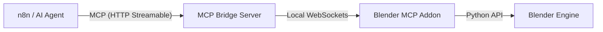
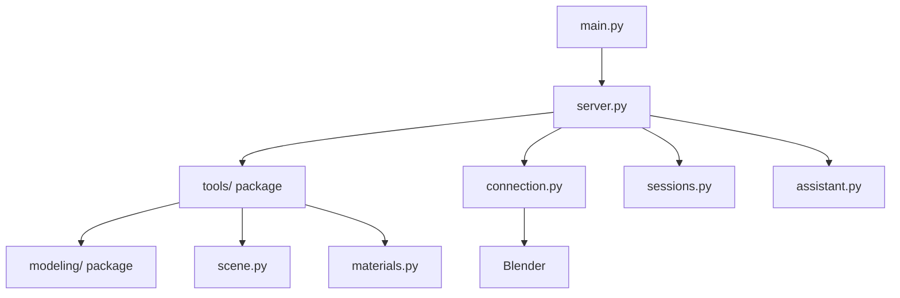

# Blender MCP Server for n8n

A Model Context Protocol (MCP) server that exposes Blender's 3D modeling capabilities to n8n workflows.

## System Architecture

To avoid confusion, this project consists of two core components:

1.  **Blender MCP Addon**: A plugin installed *inside* Blender. It acts as the local execution engine, receiving commands and manipulating the 3D scene.
2.  **MCP Bridge Server**: A standalone Python server (`src/`) that acts as the gateway. Clients like **n8n** connect to this Bridge, which then forwards commands to the active Blender Addon.



## Quick Start

### 1. Install Dependencies

We recommend using [`uv`](https://docs.astral.sh/uv/) for fast virtual environment management and package installation:

```bash
# 1. Sync dependencies (automatically creates .venv if missing)
uv sync

# 2. Activate it
# Windows:
.venv\Scripts\activate
# macOS/Linux:
source .venv/bin/activate
```

## Configuration

Create a `.env` file in the root directory to customize your setup:

| Variable | Description | Default |
|---|---|---|
| `MCP_BRIDGE_HOST` | Host IP for the MCP Bridge Server | `0.0.0.0` |
| `MCP_BRIDGE_PORT` | Port for the MCP Bridge Server (n8n connects here) | `8008` |
| `BLENDER_ADDON_HOST` | IP where Blender is running (for Bridge to connect to) | `127.0.0.1` |
| `BLENDER_ADDON_PORT` | Port Blender addon is listening on | `8888` |
| `BLENDER_ASSETS_DIR` | Directory to resolve relative textures/HDRIs | (Optional) |

## Installation

### Method 1: Zip & Install (Recommended)
1. Zip the `blender_mcp_addon` folder (into `blender_mcp_addon.zip`).
2. Open Blender.
3. **For Blender 4.2+**: Go to **Edit** > **Preferences** > **Get Extensions** > Click the dropdown arrow in the top right > **Install from Disk...** and select the `.zip`.
   **For Blender 4.0 / 4.1**: Go to **Edit** > **Preferences** > **Add-ons** > **Install...** and select the `.zip`.
4. Search for "Blender MCP" and enable the checkbox.

### Method 2: Manual Copy (Developer)
1. Copy the `blender_mcp_addon` folder to your Blender addons directory:
   - **Windows**: `%USERPROFILE%\AppData\Roaming\Blender Foundation\Blender\4.x\scripts\addons`
   - **macOS**: `~/Library/Application Support/Blender/4.x/scripts/addons`
2. Restart Blender.
3. Enable "Blender MCP" in Preferences.

## Why a folder instead of a single file?
As the addon grows, a single 1800+ line file becomes unmaintainable. We've split the logic into functional modules (`modeling`, `materials`, `anim`, etc.) to make it professional, readable, and easier to extend.

## Usage

### 1. Start Blender MCP Addon

1. Open the **N Panel** (press `N` in the 3D Viewport).
2. Look for the **Blender MCP** tab.
3. Click **Start MCP Server**.

### 2. Start the MCP Bridge Server

```bash
# Standard mode
uv run python -m src.main serve

# Recording mode (Save all commands to a file)
uv run python -m src.main serve --record my_session.json --name "Building My House"
```

The server will start on `http://localhost:8008` with HTTP Streamable endpoint at `/mcp`. It uses detailed logging to show exactly which tools are being called and their results.

## Bridge Sessions (Record & Playback)

The **Bridge Sessions** feature allows you to record yours or an AI's tool calls and replay them later. This is useful for macros, versioning your creations, or setting up complex scenes consistently.

### Recording a Session
To record all tool calls made to the bridge while the server is running:
```bash
uv run python -m src.main serve --record path/to/session.json --name "My Project" --description "Optional description"
```
Any tool calls made by n8n or other clients will be automatically saved to the JSON file.

### Replaying a Session

To playback a previously recorded session:
```bash
# Default (Stateful - HTTP Streamable) - Recommended for speed
uv run python -m src.main play path/to/session.json

# Stateless mode (Standard HTTP) - Slower due to handshake overhead
uv run python -m src.main play path/to/session.json --transport stateless
```

> [!TIP]
> **Performance Note**: Stateful mode is significantly faster for playback because it maintains a persistent connection. Stateless mode requires a full MCP handshake (Initialize/Discover) for *every* individual tool call in the recording, leading to noticeable overhead.

### Session Format
Sessions are stored as JSON files containing metadata (name, description) and a list
of command objects (tool name, arguments). Studio sessions may also include optional
`parameters` (global, parametric values referenced from command arguments via
`${name}` tokens, including arithmetic expressions) and `branches` (named, jumpable
subsets of the command list). Plain linear sessions with neither key work exactly
as before.

### Studio (Visual Editor)
Studio is the built-in visual editor for inspecting, editing, and replaying your
recordings — a Vite + React app that talks directly to the MCP Bridge Server.

**Setup** (run from the `studio/` directory, not the project root — it's a separate
npm package from any Node tooling elsewhere in the repo):

```bash
cd studio
npm install
```

**Development** — starts a hot-reloading dev server (default `http://localhost:5173`):
```bash
npm run dev
```

**Production build** — outputs a static bundle to `studio/dist/`:
```bash
npm run build
```

**Preview a production build** — serves the `dist/` output locally to sanity-check it
before deploying:
```bash
npm run preview
```

Once built, the Bridge Server also serves Studio directly at **`http://localhost:8008/studio/`**
(no separate `npm run dev` needed) — if `studio/dist/` doesn't exist yet, that route
returns a short message with the build command instead of failing.

Studio talks directly to the MCP Bridge Server over HTTP (same `/mcp` endpoint used
by n8n), so **the Bridge Server must be running** (`uv run python -m src.main serve`)
for Studio to connect. It auto-detects the bridge on `localhost:8008` then
`localhost:8000`.

In Studio you can:
- Edit session metadata (Name, Description, AI Model).
- Filter commands by tool name.
- **Add & Edit Commands**: an interactive modal with schema validation to discover
  tools, safely modify arguments, or add entirely new steps.
- Edit tool arguments directly in the JSON editor cards, or toggle to a whole-session
  **Guided / JSON view** for bulk edits with a command outline for quick navigation.
  JSON mode includes live parametric-expression linting (undefined `${param}`
  references, divide-by-zero, and syntax errors are flagged inline and block Apply).
- Reorder or delete commands, and replay them from the **ActionBar** (Play All / Play
  / Play to Active / Stop / Undo / Redo / Reset / Clear Scene), always visible at the
  top of the **Command Timeline** dock regardless of whether the timeline's diagram
  is expanded or collapsed.
- Define **global parameters** (`${name}` tokens, including arithmetic expressions
  like `${box_height} / 2`) so command arguments stay reusable across resizes/edits.
- Define **branches** — named, non-contiguous ranges of the command list you can jump
  between and run independently (e.g. a "plain" feature vs. a "with extra part"
  feature sharing a common base) — via the Branches panel's click-to-pick range
  builder, then pick and run one from the ActionBar's branch dropdown.
- **Command Timeline**: a horizontal diagram of command order and branch ranges at
  the bottom of the window (resizable, click a tick to jump to that command). Long
  branch ranges can be collapsed into a single condensed marker (click a branch's
  range bar, Excel-style column grouping) to keep the diagram readable in sessions
  with many commands.
- **Export JSON** to save your changes to a new file.

### AI Assistant Panel (n8n-free Alternative)

Studio also includes a standalone **AI Assistant** — a resizable chat drawer (toggle
with the header's 🤖 button) that lets you drive Blender with natural language,
without setting up n8n at all. It talks directly to an LLM provider through the
Bridge Server's `/assistant/*` endpoints, using the same MCP tool set as everything
else in this project.

- **Multi-provider**: switch between **Anthropic (Claude)**, **Google (Gemini)**, and
  **OpenRouter** (which unlocks most open models, including free ones) via a dropdown.
  Custom model IDs can be saved per provider and persist across restarts.
- **API keys**: read from the Bridge's environment by default; a key pasted into the
  panel (stored only in your browser) overrides it — useful when the bridge host has
  no key configured, or when experimenting with a different provider.
- **Load STL**: upload a model file directly from the panel; it's saved under
  `BLENDER_ASSETS_DIR/uploads/` and imported into the scene automatically.
- **Vision-verified agent loop**: when a tool call produces a screenshot or render,
  the image is attached to the conversation (in each provider's native image format),
  so the model can actually *see* the result of its own edits — catching floating or
  misaligned geometry that numeric verification alone would miss. Models without
  vision support get a graceful fallback to numeric-only verification.
- **Recordable**: like every other client, assistant-driven tool calls flow through
  the same session recorder (`serve --record`), so an AI conversation produces a
  replayable `session.json`.

The community [Benchy sail rig](community/benchy/README.md#branch-sail_rig--a-decorative-square-rig-sail)
was designed almost entirely through this panel — including the print-design fixes
(diamond-profile spars, flush bar tips) discovered by looking at real slicer output.

### Demo Mode (No Bridge Required)

**[Live demo on GitHub Pages](https://seehiong.github.io/blender-mcp-n8n/)** —
auto-deployed by [`.github/workflows/deploy-studio.yml`](.github/workflows/deploy-studio.yml)
on every push to `main` that touches `studio/`. There's no Bridge Server to reach
from a Pages-hosted page, so the demo link always launches in Demo Mode.

Running Studio anywhere else (locally, or your own bridge that happens to be down)
behaves differently on purpose: the header shows **"Offline"** and a
**"▶ Try Demo Mode"** button — demo mode is opt-in there, never automatic, so a
genuinely offline bridge is never silently mistaken for a working connection.

Either way, once in Demo Mode:
- Loads a static tool catalog (`studio/src/lib/demoTools.js`) so the guided forms,
  schema validation, and the **+ New Command** / **Edit Command** modals all work
  normally.
- Simulates tool execution and playback (`studio/src/lib/demoApi.js`) instead of
  calling a real bridge — good for exploring the session editor, branches, and the
  Command Timeline with any of the [community sample sessions](community/README.md).

What demo mode **doesn't** do: it can't talk to Blender, so nothing is actually
rendered or exported, and the **AI Assistant panel is disabled** while it's active
(it needs a live bridge and a real model API to do anything meaningful). Exit demo
mode any time with the header's "✕ Exit Demo" button.

### 3. Configure n8n Workflow


1. Add **MCP Client Tool** node
2. Configure:
   - **HTTP Streamable Endpoint**: `http://localhost:8008/mcp`
   - **Authentication**: None
   - **Tools to Include**: All
3. Connect to an **AI Agent** node

### 4. Development: Updating & Applying Changes

If you modify the addon code or the MCP server logic, follow these steps to ensure changes are applied:

1. **Reload Scripts**: In Blender, press `F3` and type **"Reload Scripts"** (or use the shortcut `Alt + R` if configured).
2. **Restart Blender Server**: In the N-Panel, click **Stop MCP Server** and then **Start MCP Server** again.
3. **Restart Python Server**: Stop and restart the server with `uv run python -m src.main serve`.

> [!IMPORTANT]
> All Blender operations now run on the main thread via a command queue, ensuring stability and preventing dependency graph errors.

## Available Tools

The server exposes **93 Blender tools** — the full reference with descriptions and
parameters lives in [docs/tools.md](docs/tools.md) (auto-generated from the tool
schemas; regenerate with `uv run python scripts/gen_tools_doc.py`, which also fails
loudly if the bridge schemas and the addon dispatch table ever drift apart).

| Category | Tools | Highlights |
|---|---|---|
| Modeling | 47 | primitives, booleans, modifiers, `create_curve` 2D drafting (lines + true arcs), `create_watertight_plate`, room shells |
| Materials | 7 | PBR materials, hex colors, texture assignment |
| Collections | 7 | create/move/organize collections |
| Sculpting | 7 | brush-based sculpt strokes and remeshing |
| 3D-Print Preparation | 6 | `check_mesh_for_printing`, `repair_mesh`, voxel remesh, import STL/OBJ/FBX, export STL/3MF |
| Scene & Diagnostics | 4 | scene/object info, viewport screenshots, distances |
| Animation | 4 | keyframes, playback range |
| Lighting & World | 3 | lights, light editing, HDRI/sky/color world background |
| Camera | 3 | cameras, look-at, active camera |
| Rendering | 3 | engine setup, frame renders |
| History / Undo | 2 | undo / redo |

## Example Usage in n8n

### Example Interaction

**User:** "Create a red metallic sphere at position [0, 0, 2]"
> **Assistant:** Perfect! I've successfully created a red metallic sphere at position [0, 0, 2]. Here's what was done:
> - Created a sphere named "RedMetallicSphere" with a radius of 1 unit at coordinates [0, 0, 2]
> - Applied a red metallic material using a polished metal preset with a red base color (#FF0000)
> 
> The sphere is now ready in your Blender scene with a shiny red metallic appearance.

**User:** "Duplicate the red sphere, move it to [5, 0, 2], and change its color to blue"
> **Assistant:** Perfect! I've successfully completed all the tasks:
> - Duplicated the red sphere and created a new object named "BlueMetallicSphere"
> - Moved it to position [5, 0, 2]
> - Changed the material to blue metallic with a polished metal finish
> 
> You now have two metallic spheres in your scene: RedMetallicSphere at [0, 0, 2] (red) and BlueMetallicSphere at [5, 0, 2] (blue).

**User:** "Select both the original red sphere and the duplicate, then add a Subdivision modifier to both"
> **Assistant:** Excellent! I've successfully:
> - Selected both spheres (RedMetallicSphere and BlueMetallicSphere)
> - Added a Subdivision Surface modifier (SUBSURF) to both objects with 2 levels of subdivision
> 
> This modifier will smooth and refine the geometry of both spheres, giving them a more polished and rounded appearance.

**User:** "Add a torus with minor_radius 0.1 and major_radius 25 at [2, 0, 0]"
> **Assistant:** Perfect! I've successfully created a torus with the specifications you requested:
> - **Name:** Torus
> - **Position:** [2, 0, 0]
> - **Major radius:** 25 (distance from center to center of the tube)
> - **Minor radius:** 0.1 (thickness of the tube)
> 
> This creates a very thin, large torus - essentially a large ring with a thin profile. It's now in your Blender scene alongside the two metallic spheres!

## Community Showcase

This project is powered by its community! Explore recorded sessions and documentation created by users to see what's possible with the Blender MCP:

*   [**Community Gallery**](community/README.md): Browse all user-submitted projects and learn how to contribute your own recordings.
*   [**Condominium Tower**](community/condominium_tower/README.md): A complete guide to creating a procedural 20-story building with glass facade and balconies.
*   [**Boolean Pavilion**](community/boolean_pavilion/README.md): Demonstrates boolean operations, unified structures, and advanced lighting/camera setup.

> [!TIP]
> **Share Your Work**: Have you built something cool? Check out our [**Contribution Guide**](community/README.md) to learn how to record, clean, and share your session with the community!

## ⚡ POWER TIPS: Avoiding Rate Limits

To prevent n8n or LLM "Too many requests" errors, follow these **Stateless Power Working** rules:

### 1. Avoid Selection-Based Workflows
❌ **Slow (4+ turns):** `select_by_pattern('Wall_*')` → `create_material('M_Gray')` → `assign_material()`
✅ **Fast (1 turn):** `create_material(name='M_Gray', pattern='Wall_*')`

### 2. Group by Collections
❌ **Unreliable:** Selecting individual objects.
✅ **Reliable:** `create_material(name='M_Glass', collection='Cutters')`

### 3. Bulk creation
If you need 10 objects, don't create them one-by-one. Use `create_and_array` or `duplicate_object` with `count`.

## Architecture & Technical Design

This project uses a modular `src/` structure to ensure maintainability:



### Transport Model

Although the MCP specification supports persistent HTTP Streamable sessions, many clients (including n8n) currently operate in a stateless execution model, performing:

`Initialize` → `Discover Tools` → `Call Tool` → `Close`

for each interaction.

The server uses the official **HTTP Streamable** transport introduced in MCP SDK 1.8.0+, which supports both stateful sessions and stateless requests.

### The Stateless Fallback Mechanism

To ensure reliability across clients, the server implements a robust fallback strategy:

1. **Protocol Resilience**: If no active HTTP Streamable session exists, the server transparently handles standard JSON-RPC requests over HTTP.
2. **Execution Isolation**: Each tool call is processed independently, preventing session corruption or deadlocks.
3. **Visual Success Indicators**: Tool responses are prefixed with `✓` when successful. This helps the AI Agent’s conversational memory confirm task completion and avoid unintended re-execution loops.
4. **Clear State Boundaries**: Persistent state is intentionally separated:
   - 🧠 **Conversation memory** → AI Agent (n8n Simple Memory)
   - 🧩 **Scene state** → Blender runtime
   - 🚀 **MCP server** → Stateless execution bridge

### Architecture Diagram

```
n8n AI Agent 
      ↓
MCP Client (HTTP Streamable / JSON-RPC)
      ↓
MCP Server (ASGI)
      ↓
TCP Socket Bridge
      ↓
Blender Addon (Main Thread Queue)
      ↓
Blender Scene (Persistent State)
```

## Testing

We use an integrated test suite to verify Blender tools and layout scenarios.

```bash
# Run the Arch layout test
uv run python tests/run_integration.py run --scenario arch

# Run the standard functional grid test
uv run python tests/run_integration.py run --scenario grid

# Run the 3D Printing tool verification test
uv run python tests/run_integration.py run --scenario print

# Run the Filament Name Tag & Stand generation test
uv run python tests/run_integration.py run --scenario filament_tag
```

### Scenarios

| Scenario | Key | Description |
|---|---|---|
| Grid Layout | `grid` | Functional grid test covering all tool categories |
| Arch Layout | `arch` | Architectural scene generation test |
| Print Validation | `print` | 3D printing workflow: units, mesh repair, export |
| Filament Tag | `filament_tag` | Generates a 4-piece modular filament name tag & clip system (NameTagCard, AMSClip, StickonHolder, DeskStand) |

See the [Integration Testing Guide](docs/integration_tests.md) for full details on verification and benchmarking.

## Code Quality & Standards

We enforce code quality standards using [Ruff](https://docs.astral.sh/ruff/) and [Mypy](https://mypy.readthedocs.io/). These are run automatically on GitHub Actions CI.

To run these checks locally:

```bash
# 1. Format code (strict black-compatible formatting)
uv run ruff format src/ tests/ blender_mcp_addon/

# 2. Run linter and check code complexity (McCabe <= 12)
uv run ruff check src/ tests/ blender_mcp_addon/

# 3. Auto-fix standard lint issues
uv run ruff check src/ tests/ blender_mcp_addon/ --fix

# 4. Run static type checking
uv run mypy src/
```

## Troubleshooting

**Server won't start**: Install dependencies with `uv sync`

**Connection failed**: Ensure Blender MCP addon is running on port 8888.

**Dependency Graph Error**: If you see this, ensure you have the latest `blender_mcp_addon` package which implements the main-thread command queue.

**Tools not appearing in n8n**: Check the HTTP Streamable endpoint URL is correct (`http://localhost:8008/mcp`)

## Acknowledgments

This project was inspired by [blender-mcp](https://github.com/ahujasid/blender-mcp) by [ahujasid], which demonstrated the potential of MCP servers for Blender automation.

## License

MIT License - See LICENSE file for details


