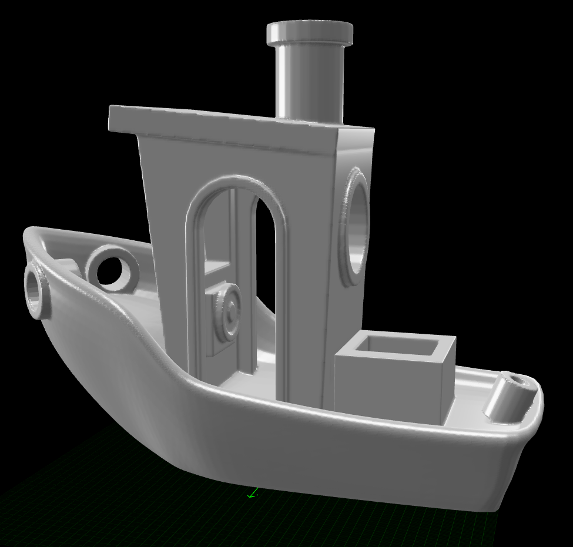
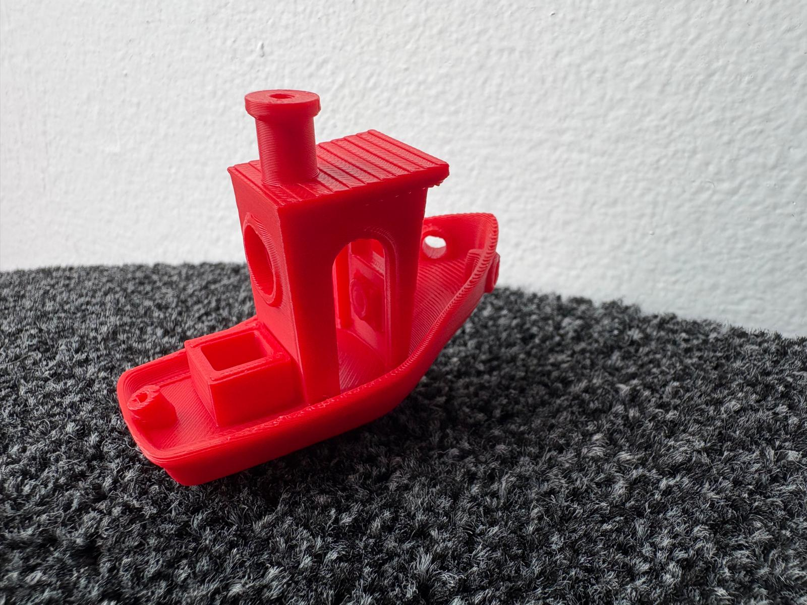
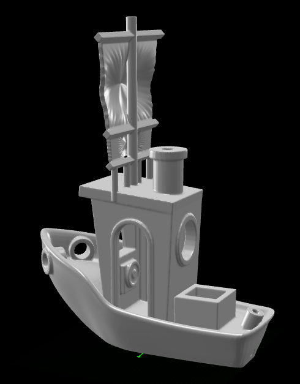
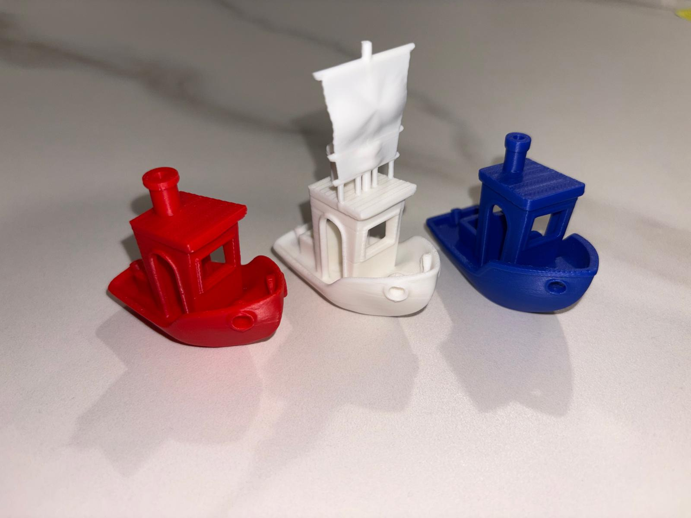

# SH Benchy — Measured Recreation of the #3DBenchy

A complete recreation of the famous [#3DBenchy](https://3dbenchy.com) calibration boat,
built **entirely from measurements** — cross-sections, silhouettes, and feature positions
extracted programmatically from the reference STL, combined with the hard dimensions from
the official brochure (60.00 × 31.00 × 48.00 mm, 23.00 mm roof at 5.5°, 10.50 × 9.50 mm
front window, ø9/ø12 stern window, ø3 × 11 mm chimney bore, 12.00 × 10.81 × 9.00 mm deck
box…). No geometry was copied; every vertex was derived, placed, and verified across
**51 build iterations** driven through the Blender MCP bridge.

**Model Used:** claude-fable-5 (Claude Code)



## How to Replay

To recreate this Benchy in your own Blender instance, ensure the MCP server is running and execute:

```bash
python -m src.main play community/benchy/session.json
```

One replay produces the full model and exports a print-ready `sh_benchy.stl`.
The session is idempotent: it wipes the scene and rebuilds from scratch every run.

> [!IMPORTANT]
> Use the current bundled Blender addon (`blender_mcp_addon/`) — this session relies on
> its batch-safe `delete *`, deterministic cap triangulation, and loud-failure modifier
> baking. Older addon builds will fail the cleanup step or produce corrupted geometry.

## What the Session Builds

| Stage | Highlights |
|---|---|
| Hull | 9-ring `create_polygon` loft from measured stations: 40° spoon bow, upright bulwark band, uniform 2.6 mm gunwale rail (true perpendicular offsets), 69° raked transom, keel + deck spine rings so both caps are clean quads |
| Deck | Flat aft cockpit at Z=8.5, exact 45° companionway ramp, rising foredeck — all measured |
| Details | Hawsepipe "eyes" as true pipes with flange rings, prop-shaft socket, raked fishing-rod holder, deck box with spec 9.00 mm pocket |
| Cabin | Trapezium loft wheelhouse, side arches with raised double frames, front + stern windows aligned at Z=32 with unified 1.2 mm frames, helm console with recessed steering wheel |
| Roof & chimney | Measured trapezoid roof (rear-flush, front-flared visor) at 5.5°, chimney to exactly 48.00 mm with spec bore |
| Print prep | Bake all booleans → level-2 subsurf on the hull → join 18 parts → 0.15 mm voxel remesh (watertight fuse) → Laplacian smoothing → re-drill eyes + prop socket → engrave **SH BENCHY** 0.25 mm into the flat bottom → `check_mesh_for_printing` → STL export |

## Hard-Won Lessons Baked Into This Session

- **Big cap n-gons tent.** A loft's end cap over a height-varying ring gets triangulated
  unpredictably — bridging triangles domed our deck and crumpled the hull bottom. Fix:
  spine rings so caps degrade to thin coplanar slivers, plus deterministic cap
  triangulation in the addon.
- **Small holes don't survive subdivision + voxel remesh.** Subsurf pinches a ø4 hole
  nearly shut and the remesh unions the pinched material into a membrane. Fix: re-drill
  every bore into the final solid, after smoothing.
- **Engrave bottom text, don't raise it** — the print bed needs a flat first layer;
  the original's shallow bottom letters exist precisely to reveal first-layer squashing.
- **Boolean holders before cutters** when cleaning a scene, or batch-delete both together.

## Printing

Load `sh_benchy.stl` into your slicer. Like the original, it is designed to print at
1:1 without supports — hull overhang ≈ 40°, flat bottom with engraved nameplate,
verified watertight before export.


*The final printed SH Benchy — photo coming after the first print!*

## Branch: `sail_rig` — A Decorative Square-Rig Sail

A second, display-oriented build on top of the same hull: a two-sail square rig
(mast, yard, boom, lower spar, main + second sail with a sculpted cloth billow),
designed and refined through the [AI Assistant panel](../../README.md) with
live viewport screenshots for self-verification. Every fix — from a floating
sail to overhanging spar tips — was driven by an actual slicer test, not a guess.

```bash
python -m src.main play community/benchy/session.json --branch sail_rig
```

(Or run the `sail_rig` branch directly from Blender Studio.) This exports a
second STL, `sh_benchy_sail.stl` — the merged hull + rig, solidified,
voxel-remeshed, decimated, and watertight-checked, same as the classic export.

  
*The two-sail rig — mast planted in the cabin roof, forward of the chimney*

### Lessons From Making It Print Support-Free

- **Horizontal round bars always overhang.** A cylindrical spar's underside is
  a 90° overhang along its whole length — no amount of bracing underneath
  fixes it, since the slicer still trees up to fill the gaps between braces.
  Fix: build spars with a **diamond cross-section** (`vertices=4`, rotated
  90° so a corner points down) — the two 45° facets read as self-supporting.
- **Bar tips must land inside a supporting sheet.** A spar tip protruding even
  2–3mm past the sail it's attached to becomes a floating island. Tips are
  sized flush with (or slightly recessed into) their sail.
- **Vertical is always safe.** Where a bracing structure kept getting flagged
  no matter the angle, switching to plain vertical posts (equally spaced,
  ≤6mm apart to stay within bridging limits) resolved it immediately.
- **Thin decorative sheets need real thickness before export** — the sails
  are zero-thickness cloth shapes until a `SOLIDIFY` pass (1.0mm) is applied,
  then joined into the hull and voxel-remeshed into one watertight body.
- **Simplify before export.** The merged, remeshed body easily exceeds 1M
  triangles, which most slicers flag. A `DECIMATE` pass (ratio 0.35) brings
  it back under budget while preserving the engraved bottom text far better
  than a coarser remesh would.


*Final slice — auto-supports found nothing to flag*
