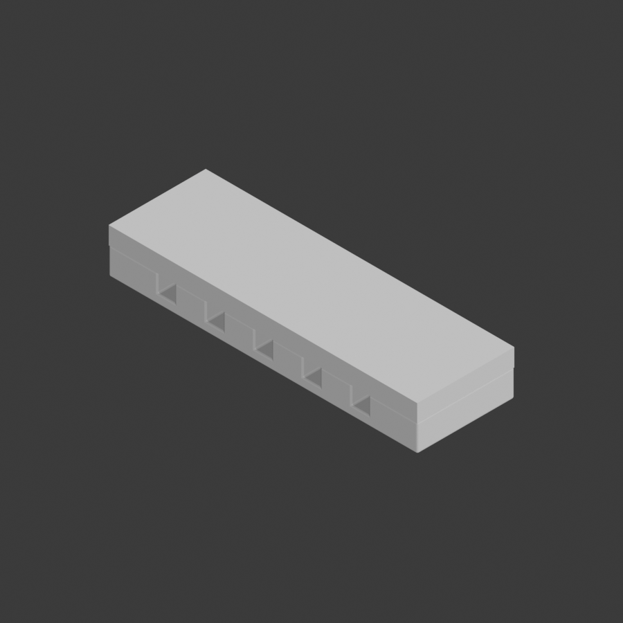
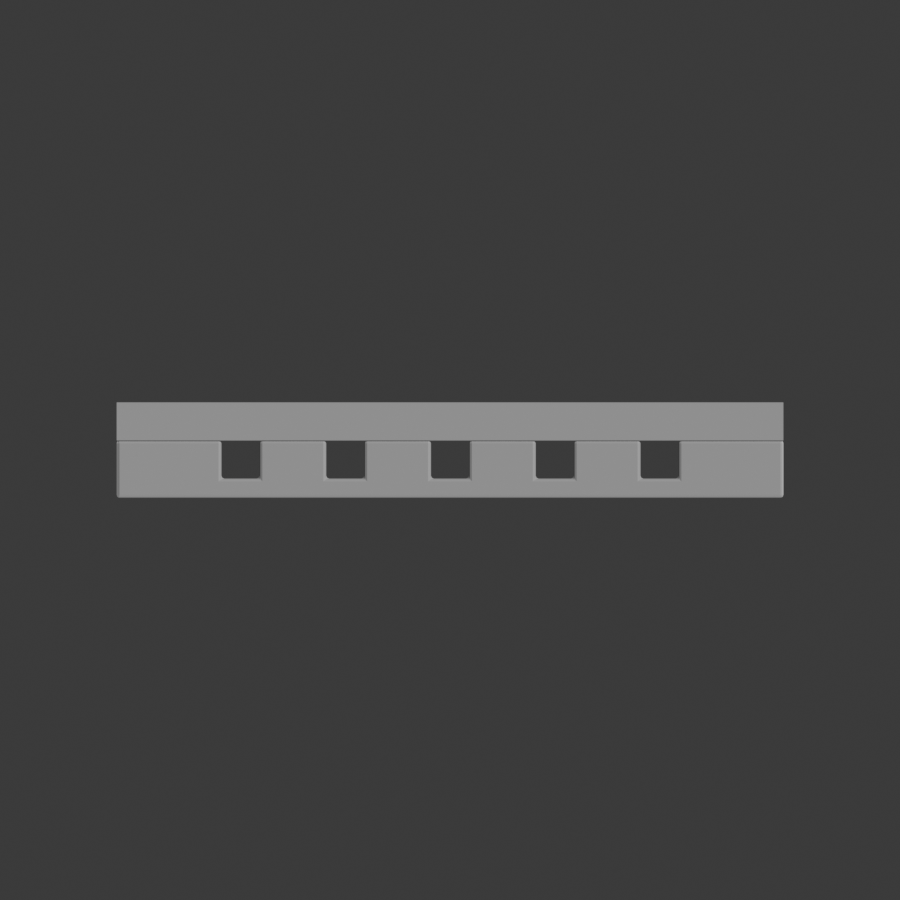
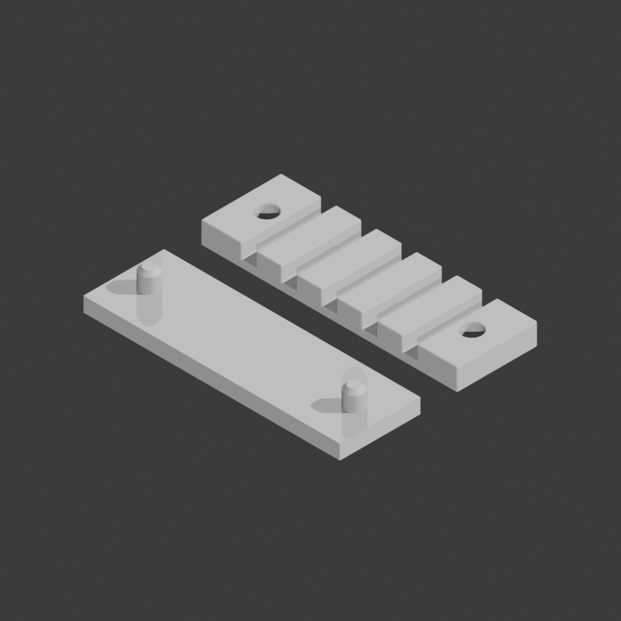
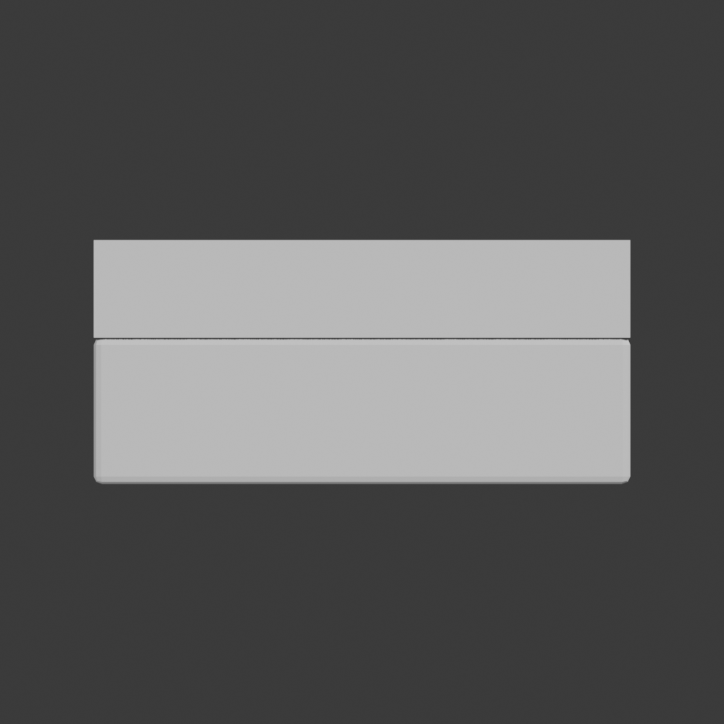

# Cable Comb



A two-part desk cable organiser. The **comb** lies flat with five cable slots; the
**base** caps it, pins pointing down through the comb's holes, so the open slots
become **enclosed channels** that hold cables captive. Lift the base off to
re-route a cable, press it back on to tidy up.

Both parts print flat with **no supports** — the steepest true overhang is the 45° pin chamfer, and the base has none over 28.5°.

## Views

| | |
|---|---|
|  |  |
| **Assembled** — the base caps the comb, turning the slots into closed channels | **As printed** — both parts flat on Z=0, side by side, pins up |
|  |  |
| **Top** — five cable slots and the two pin holes | **Side** — 10 mm assembled height |

## Why the holes go all the way through

The comb's pin holes are **through holes**, and that is deliberate:

- A blind pocket would need its roof bridged over a 5.25 mm void — the one place
  this design would have needed support material.
- The pin is 5 mm and the comb 6 mm, so a blind hole leaves ~1 mm of roof. Any
  print tolerance stacking there and the pin bottoms out before the parts seat.
- Through holes are self-clearing: desk dust and stray filament push straight out
  rather than packing into the bottom of a blind hole.

Assembled, the base's plate rests on the comb's top face and the pins reach 5 mm
down into the 6 mm bore, stopping 1 mm short of the underside — engaged, but not
poking through onto the desk.

Because the bevel funnels *both* faces equally, the comb also has no wrong way up.

## Why this project exists

Every dimension here is set by a rule extracted from a YouTube tutorial by
[print-kb](../../docs/design-rules.md) and served to the modelling agent as MCP
tools. It is a test of whether that knowledge base actually changes what gets
modelled — so the design leans on the rules where they are strongest, which is
pin-and-hole joints.

The two numbers that decide whether the parts fit are **attested**, meaning a
video stated them rather than them coming from a default:

| dimension | value | rule | source |
|---|---|---|---|
| hole over pin | **0.25 mm** | make the hole ~0.25 mm larger than the pin, for shrinkage | [Ultimate Guide to Connecting 3D Printed Parts @ 25:54](https://www.youtube.com/watch?v=vsHpiHhB3RU&t=1554s) |
| pin tip | **45° chamfer** | chamfer, not fillet — a chamfer holds a constant overhang | [same video @ 18:30](https://www.youtube.com/watch?v=vsHpiHhB3RU&t=1110s) |
| min wall | **1 mm** | no wall thinner than 1 mm | [8 Essential Design Rules @ 00:11](https://www.youtube.com/watch?v=1n_R8shlGcs&t=11s) |

The full rule list, including the ones deliberately *not* applied and why, is in
[`assets/design_v1.md`](assets/design_v1.md).

## Dimensions

| part | size | features |
|---|---|---|
| Base | 70 × 22 × 4 mm | two ⌀5.0 mm pins, 5 mm tall, 45° chamfered tips, at x = ±28 |
| Comb | 70 × 22 × 6 mm | two ⌀5.25 mm through holes, five 4 mm cable slots 4 mm deep |

Seated, the pin tip sits 1 mm below the comb's top face — engaged but recessed.

## Verified against the exported STLs

Measured from the STL files, not from the modelling commands reporting success:

```
pin shaft      ⌀5.000 mm   (spec 5.000)
hole           ⌀5.250 mm   (spec 5.250)
clearance       0.250 mm diametral, 0.125 per side   (spec 0.250)
pin chamfer    45.00°      (spec 45)
slot           4.0 mm wide × 4.0 deep, 7.0 mm walls, 2.0 mm floor
fillet         0.3 mm at hole mouths and inside corners (R5, R6)
overhangs      base 28.5° worst; comb's only >45° faces are the bottom
               edge rounding, 0.127 mm tall — under one 0.2 mm layer
watertight     yes, 0 non-manifold edges (both parts)
```

## Printing

- **Orientation:** both parts flat on the build plate, side by side, exactly as
  the session leaves them. The base prints **pins up** so they are
  self-supporting; it is flipped over to assemble.
- **Supports:** none needed.
- **Layer height:** 0.2 mm. The 0.25 mm joint clearance assumes a reasonably
  calibrated printer; if your parts come out tight, that is the number to open up
  — the rule that set it also notes 0.2–0.25 mm for less precise machines.
- **Material:** PLA is fine. The clearance rule targets shrinkage, so a
  higher-shrinkage material (ABS, PA) wants the 0.5 mm variant of the same rule.

## Files

| file | what it is |
|---|---|
| [`session.json`](session.json) | 34-command build, replays on a fresh Blender scene |
| [`assets/design_v1.md`](assets/design_v1.md) | locked spec, every dimension cited to its rule |
| `assets/cable_comb_base.stl` | the base |
| `assets/cable_comb_comb.stl` | the comb |

## Reproducing

```bash
python -m blender_mcp_bridge.main play community/cable_comb/session.json
```

The session wipes the scene first, so it is idempotent. It also cleans up after
itself: the pin pieces and the hole/slot cutters are deleted once their booleans
are baked, and the comb is moved onto the base at the end. A replay therefore
leaves exactly **two** objects in the scene, seated as the finished product —
`boolean_operation` only *hides* its operand by default, so without those deletes
the scene ends up holding thirteen objects and the comb floating 44 mm up where
it was modelled.

## Fillets

Rules R5 and R6 ask for a fillet at the hole mouth (so the pin is funnelled in)
and on inside corners (to avoid stress risers). Both are in the model, applied as
a **0.3 mm bevel with 2 segments** on each part.

The width is deliberate. At 0.5 mm the rounding of the comb's *bottom* edge flared
0.21 mm outward, which at a 0.2 mm layer height reads as a first-layer overhang.
At 0.3 mm the flare is 0.127 mm — inside a single layer, so the slicer prints it
as a vertical wall.

The bevel does not touch the joint: `use_clamp_overlap` keeps it off the 45° pin
chamfer, and the bore holds ⌀5.250 mm through the full engagement depth with a
0.3 mm funnel at each mouth. Because the comb is symmetric, it goes on either way
up.
