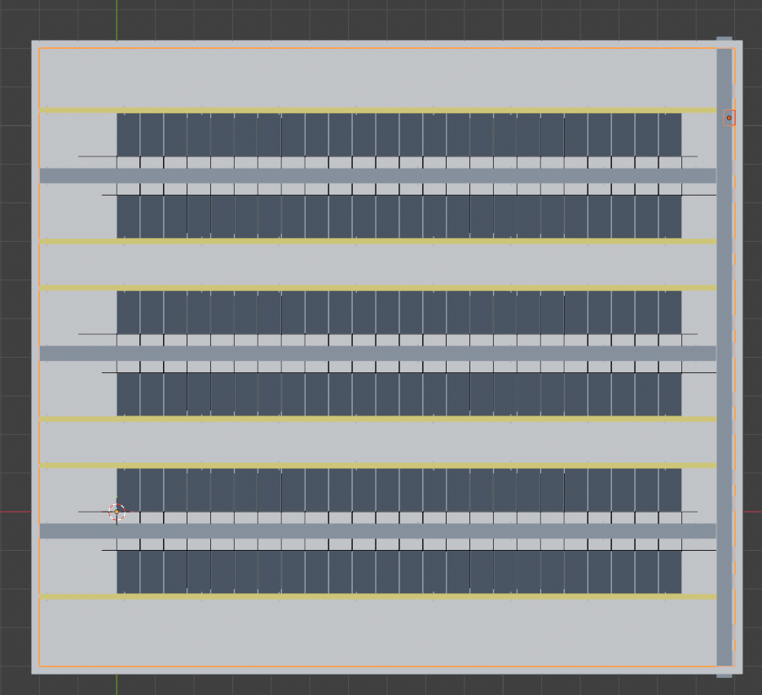
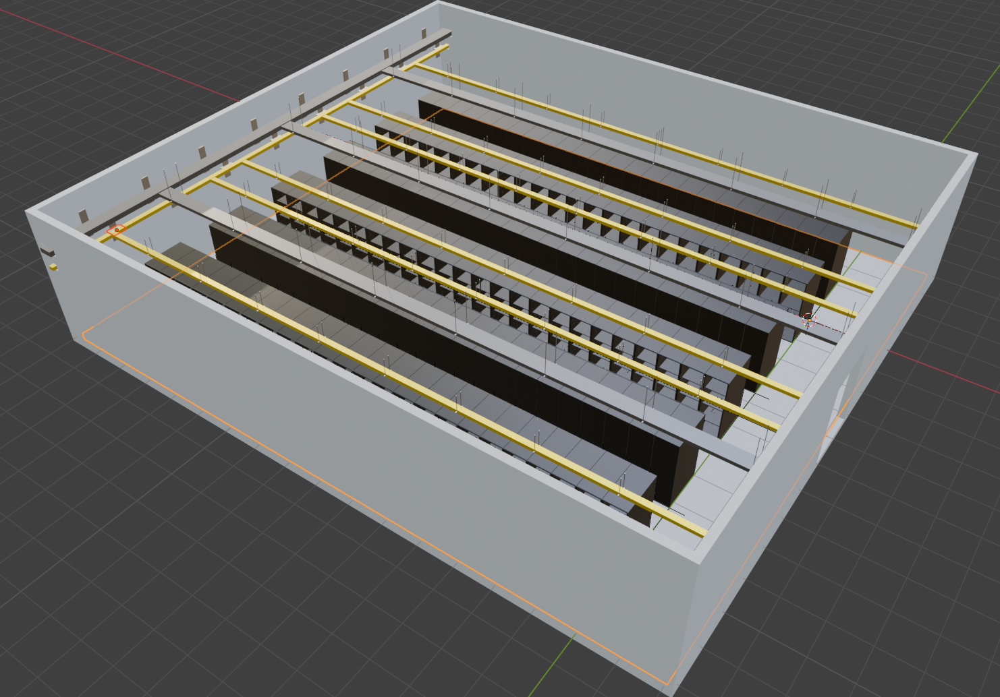

# Data Center with MEP Systems

This community project demonstrates how to model a realistic data center with full MEP (Mechanical, Electrical, Plumbing) systems using Blender MCP tools. The scene features parametric server rack libraries, hot/cold aisle arrangements, and layered cable tray routing — all built procedurally from prompts.

**Model Used**: gpt-4.1 (without memory)



---

## How to Replay

To recreate this data center in your own Blender instance, ensure the MCP server is running and execute:

```bash
python -m src.main play community/data_center_with_mep/session.json
```

---

## Layout Overview

- **Room**: 18m × 16m server hall (−2 to 16m on X, −4 to 12m on Y), 4m ceiling height
- **Rack Rows**: 24 racks per row (0.6m wide × 1.2m deep × 2m tall), facing back-to-back with 1m aisle clearance
- **Aisles**: 3 Hot Aisles + 4 Cold Aisles, duplicated at 4.6m spacing along Y
- **Power Trays**: Ladder-type, 400mm wide, run at Z=3.0m (horizontal) and Z=3.0m (vertical riser)
- **Data Trays**: Solid-type, 150mm wide, run at Z=2.5m — two per cold aisle (left + right of rack rows)

---

## User Prompts to Recreate in Blender

### 1. Scene Reset

**User:**
> 1.1 Delete all existing objects to start clean

**Assistant:**
> All existing objects and collections have been deleted. The scene is now clean and ready for new modeling or setup. Let me know what you’d like to create next!

---

### 2. Server Rack Library — Frame

**User:**
> 2.1 Create a solid cube named `Rack_Frame` in collection `Server_Rack` at location (0.3, 0.6, 1.0), dimensions (0.6, 1.2, 2.0)

**Assistant:**
> The solid cube named Rack_Frame has been created in the collection Server_Rack, with the following specifications:
> Location: (0.3, 0.6, 1.0)
> Dimensions: (0.6, 1.2, 2.0)
>
> Let me know if you’d like to view, modify, or add more elements to your server rack!


**User:**
> 2.2 Create a slightly smaller cutter cube named `Rack_Cutter` at (0.3, 0.65, 1.0), dimensions (0.55, 1.2, 1.95) in existing `Server_Rack`

**Assistant:**
> The cutter cube named Rack_Cutter has been created in the Server_Rack collection with the specified dimensions of (0.55, 1.2, 1.95) meters and positioned at (0.3, 0.65, 1.0).
>
> Would you like to use this cutter to perform a boolean operation on another object, or proceed with further modifications?


**User:**
> 2.3 Apply a DIFFERENCE boolean on `Rack_Frame` using `Rack_Cutter` (EXACT solver), hide the cutter

**Assistant:**
> The DIFFERENCE boolean operation has been applied to Rack_Frame using Rack_Cutter (with the EXACT solver), and the Rack_Cutter object has been hidden as requested.
>
> If you need a viewport screenshot or follow-up adjustments, let me know!

---

### 3. Server Rack Library — Shelves & Door Frame

**User:**
> 3.1 Use `create_and_array` to create `Rack_Tray` (cube, 0.55 × 1.0 × 0.02m) in `Server_Rack`. Array count: 3, offset [0, 0, 0.5]. Starting at (0.3, 0.6, 0.5)

**Assistant:**
> The cube Rack_Tray (dimensions: 0.55 × 1.0 × 0.02m) has been created in the Server_Rack collection. It uses an array modifier: a set of 3 trays, each spaced apart by 0.5m along the Z-axis, starting at position (0.3, 0.6, 0.5).
>
> Would you like a viewport screenshot or any further operations on these trays?


**User:**
> 3.2 Create `Rack_Door_Frame` (cube, 0.6 × 0.01 × 2.0m) at (0.3, 1.2, 1.0) in `Server_Rack`

**Assistant:**
> The Rack_Door_Frame has been successfully created at (0.3, 1.2, 1.0) with dimensions 0.6 × 0.01 × 2.0 meters in the Server_Rack collection. Would you like to do anything else?


**User:**
> 3.3 Apply a WIREFRAME modifier to `Rack_Door_Frame` (thickness 0.02, replace original)

**Assistant:**
> The WIREFRAME modifier has been applied to Rack_Door_Frame with a thickness of 0.02 and set to replace the original geometry. If you'd like to see a viewport screenshot or need further modifications, please let me know!

---

### 4. Server Rack Library — Materials

**User:**
> 4.1 Apply a black brushed-metal material `Rack_Metal` to all objects matching pattern `Rack_*`

**Assistant:**
> The black brushed-metal material Rack_Metal has been created and assigned to all objects matching the pattern Rack_*. The assignment is complete. If you want to change the look or add more details to this material, let me know!

**User:**
> 4.2 Create `Rack_Glass_Panel` (cube, 0.58 × 0.01 × 1.98m) at (0.3, 1.2, 1.0) in `Server_Rack`, representing the front glass door

**Assistant:**
> The object Rack_Glass_Panel (cube, size: 0.58 × 0.01 × 1.98m) representing the front glass door has been created in the Server_Rack collection. Its position is set at (0.3, 1.2, 1.0), and it matches the provided dimensions.
>
> If you would like to make it look glass-like or add more details (such as handles), please let me know!

**User:**
> 4.3 Apply a tinted glass material `Rack_Glass` (alpha 0.01, IOR 1.5, roughness 0) to `Rack_Glass_Panel`.

**Assistant:**
> The tinted glass material Rack_Glass (with alpha 0.01, IOR 1.5, roughness 0) has been created and successfully applied to Rack_Glass_Panel.
>
> If you need any material tweaks or a viewport/render preview, just let me know!

---

### 5. Rack Row Instantiation — Left Row

**User:**
> 5.1 Instantiate the `Server_Rack` library collection as an empty named `Server_Rack` at (0, 0, 0) in collection `Rack_Left`

**Assistant:**
> The Server_Rack library collection has been instantiated as an empty object named Server_Rack at location (0, 0, 0) within the Rack_Left collection. The empty object is set up to instance the Server_Rack collection as requested.
>
> If you need to move, duplicate, or configure this instanced rack further, let me know!

**User:**
> 5.2 Then duplicate the selection 23 times with a 0.61m X offset into `Rack_Left` — creating a row of 24 racks.

**Assistant:**
> The selection has been duplicated 23 times with a 0.61m offset along the X-axis into the Rack_Left collection, resulting in a row of 24 racks.
>
> If you’d like to see a viewport screenshot or continue creating additional rows/racks, let me know!

**User:**
> 5.3 Hide the source `Server_Rack` library collection from viewport (keep renderable).

**Assistant:**
> The Server_Rack library collection is now hidden from the viewport but will remain visible in renders. If you need to revert or further adjust visibility, let me know!

---

### 6. Rack Row Instantiation — Right Row (Back-to-Back)

**User:**
> 6.1 Select all objects in `Rack_Left`. Duplicate the selection into a new collection `Rack_Right` with an offset of (0.6, −1.0, 0) and a 180° Z-rotation — creating the opposing rack row facing the hot aisle.

**Assistant:**
> All objects from the Rack_Left collection have been duplicated into a new collection called Rack_Right with an offset of (0.6, −1.0, 0) and a 180° Z-rotation. This creates the opposing row of server racks oriented to face a hot aisle between the two rows.
>
> If you want a viewport screenshot or further operations, just let me know!

---

### 7. Power Cable Tray — Hot Aisle Horizontal Run

**User:**
> 7.1 Build a LADDER power tray named collection `Tray_Power` running above the hot aisle at Z=3.0m:
> - Points: (−2, −0.5, 3.0) → (15.52, −0.5, 3.0)
> - Width: 400mm, Depth: 100mm
> - Support type: TRAPEZE_HANGER, spacing: 2.4m, offset from start: 0.2m, height to ceiling: 1.0m

**Assistant:**
> The LADDER-type power cable tray named Tray_Power has been created in the Tray_Power collection:
> - Path: From (−2, −0.5, 3.0) to (15.52, −0.5, 3.0) meters
> - Tray width: 400mm
> - Tray depth: 100mm
> - Mounted at Z = 3.0 meters
> - Support type: TRAPEZE_HANGER
> - Support spacing: 2.4m, offset 0.2m from start
> - Hanger rod length to ceiling: 1.0m
>
> Let me know if you need a view, more trays, or cross-section details!

---

### 8. Grouping into Hot Aisle 1 & Duplicating

**User:**
> 8.1 Move collections `Rack_Left`, `Rack_Right`, and `Tray_Power` into a parent collection `Hot_Aisle_1` (keeping hierarchy, removing from originals).

**Assistant:**
> The parent collection Hot_Aisle_1 has been created. The collections Rack_Left, Rack_Right, and Tray_Power were moved into Hot_Aisle_1, keeping their internal hierarchies and removing them from their original parent locations.
>
> If you need to view, rename, or manipulate anything within or about Hot_Aisle_1, let me know!

**User:**
> 8.2 Duplicate `Hot_Aisle_1` into `Hot_Aisle_2` with Y offset +4.6m.

**Assistant:**
> The collection Hot_Aisle_1 has been duplicated into Hot_Aisle_2 with a Y offset of +4.6 meters. The entire hierarchy, including 73 objects and 4 collections, was successfully copied.
>
> If you need further modifications or want to verify the result with a screenshot or more information, please let me know!

**User:**
> 8.3 Duplicate `Hot_Aisle_2` into `Hot_Aisle_3` with Y offset +4.6m.

**Assistant:**
> The collection Hot_Aisle_2 has been duplicated as Hot_Aisle_3 with a Y offset of +4.6m. This operation copied 73 objects and 4 collections, preserving the entire hierarchy in the new location.
>
> If you would like a viewport screenshot or need anything else adjusted, please let me know!


---

### 9. Data Cable Trays — Cold Aisle Horizontal Runs

**User:**
> 9.1 Build two SOLID data trays per cold aisle at Z=2.5m (below the power tray), width 150mm, depth 100mm. TRAPEZE_HANGER supports, 2m spacing.
> - `Tray_Data_Left`: Points (−2, 1.2, 2.5) → (15.64, 1.2, 2.5), collection `Tray_Data_Left`
> - `Tray_Data_Right`: Points (−2, 2.4, 2.5) → (15.64, 2.4, 2.5), collection `Tray_Data_Right`
>

**Assistant:**
> Both solid cable tray runs have been built as requested:
> - Tray_Data_Left:
>   - Path: (−2, 1.2, 2.5) → (15.64, 1.2, 2.5)
>   - Width: 150 mm, Depth: 100 mm
>   - Tray type: SOLID (DATA system)
>   - Collection: Tray_Data_Left
>   - Supports: TRAPEZE_HANGER, 2 m spacing
> - Tray_Data_Right:
>   - Path: (−2, 2.4, 2.5) → (15.64, 2.4, 2.5)
>   - Width: 150 mm, Depth: 100 mm
>   - Tray type: SOLID (DATA system)
>   - Collection: Tray_Data_Right
>   - Supports: TRAPEZE_HANGER, 2 m spacing
>
> Let me know if you want a viewport screenshot or to proceed with other trays, labeling, or color-coding!

**User:**
> 9.2 Group `Tray_Data_Left` and `Tray_Data_Right` into new collection `Cold_Aisle_2`

**Assistant:**
> The collections Tray_Data_Left and Tray_Data_Right are now grouped inside a new parent collection called Cold_Aisle_2. The original hierarchy for each tray collection has been preserved under this new collection. If you need any further organization or modifications, just let me know!

**User:**
> 9.3 Duplicate `Cold_Aisle_2` → `Cold_Aisle_3` (offset Y +4.6m).

**Assistant:**
> The collection Cold_Aisle_2 has been duplicated as Cold_Aisle_3 with a Y offset of +4.6 meters. The hierarchy duplication included 56 objects and 3 collections. Let me know if you’d like a viewport screenshot or further operations!

**User:**
> 9.4 Duplicate `Cold_Aisle_3` → `Cold_Aisle_4` (offset Y +4.6m)

**Assistant:**
> The collection Cold_Aisle_3 has been successfully duplicated as Cold_Aisle_4, with a Y offset of +4.6 meters. The duplication includes 56 objects and 3 nested collections.
>
> If you need any adjustments or want a screenshot, just let me know!

**User:**
> 9.5 Delete `Tray_Data_Right` collection from `Cold_Aisle_4`

**Assistant:**
> The Tray_Data_Right collection has been deleted from Cold_Aisle_4 successfully. If you need further changes or want to confirm the result visually, let me know!

**User:**
> 9.6 Duplicate `Cold_Aisle_2` → `Cold_Aisle_1` (offset Y -4.6m)

**Assistant:**
> The collection Cold_Aisle_2 has been successfully duplicated as Cold_Aisle_1 with a Y offset of -4.6 meters. This duplication includes the entire hierarchy (56 objects and 3 sub-collections). If you need further adjustments or visualization, let me know!

**User:**
> 9.7 Delete `Tray_Data_Left` collection from `Cold_Aisle_1`

**Assistant:**
> The collection Tray_Data_Left has been deleted from Cold_Aisle_1. If you need to remove other collections or objects, feel free to specify!

---

### 10. Power & Data Vertical Risers (Main Tray Spine)

**User:**
> 10.1 Build two vertical tray runs along the side wall (X=15.73m), spanning Y from −4.3m to 12.3m:
> - Power riser: LADDER, 400mm wide × 150mm deep, Z=3.0m, WALL_BRACKET supports at 2m spacing (offset 1.2m from start), collection `Tray_Power_Main`
> - Data riser: LADDER, 150mm wide × 100mm deep, Z=2.5m, WALL_BRACKET supports at 2m spacing (offset 0.5m from start), collection `Tray_Data_Main`

**Assistant:**
> Both vertical tray runs have been created along the side wall (X=15.73m), spanning Y from −4.3m to 12.3m:
> - Power riser: LADDER type, 400mm wide × 150mm deep at Z=3.0m, with WALL_BRACKET supports at 2m spacing (starting 1.2m from the bottom) in collection Tray_Power_Main.
> - Data riser: LADDER type, 150mm wide × 100mm deep at Z=2.5m, with WALL_BRACKET supports at 2m spacing (starting 0.5m from the bottom) in collection Tray_Data_Main.
>
> If you’d like a viewport screenshot or additional details about either run, just let me know!
---

### 11. Server Hall Room Shell

**User:**
> 11.1 Using `build_room_shell` tool, build the data center room shell named `Hall` in collection `Server_Hall`:
> - Vertices: (−2, −4), (16, −4), (16, 12), (−2, 12) — an 18m × 16m footprint
> - Height: 4.0m, Wall thickness: 0.2m, Floor thickness: 0.2m
> - Main double door on edge 3: offset 7.0m, width 1.8m, height 2.4m
> - Ventilation / Conduit Sleeves (4 total):
>   - Edge 0 — offset 17.47m, Width 0.5m, Height 0.25m, Sill height 2.9m
>   - Edge 2 — offset 0.02m, Width 0.5m, Height 0.25m, Sill height 2.9m
>   - Edge 0 — offset 17.62m, - Width 0.2m, Height 0.2m, Sill height 2.4m
>   - Edge 2 — offset 0.18m, - Width 0.2m, Height 0.2m, Sill height 2.4m

**Assistant:**
> The data center room shell Hall has been created in the collection Server_Hall with the following features:
> - Footprint: 18m × 16m, vertices at (−2, −4), (16, −4), (16, 12), (−2, 12)
> - Height: 4.0 m
> - Wall thickness: 0.2 m
> - Floor thickness: 0.2 m
> - Main double door on edge 3 at 7.0 m offset, 1.8 m wide × 2.4 m high
> - 4 ventilation/conduit sleeves:
>   - Edge 0, offset 17.47 m, 0.5 m wide × 0.25 m high, sill 2.9 m
>   - Edge 2, offset 0.02 m, 0.5 m wide × 0.25 m high, sill 2.9 m
>   - Edge 0, offset 17.62 m, 0.2 m wide × 0.2 m high, sill 2.4 m
>   - Edge 2, offset 0.18 m, 0.2 m wide × 0.2 m high, sill 2.4 m
> 
> Objects created: Hall_Floor, Hall_Walls, Hall_Ceiling.
> Would you like a 3D/top view screenshot, or would you like to continue detailing the inside?

---

### 12. Final Visibility

**User:**
> 12.1 Make `Hall_Ceiling` visible in viewport and renderable.

**Assistant:**
> The object Hall_Ceiling is now set to be visible in the viewport and will also appear in renders. If you have any more visibility or rendering requirements, let me know!

---

