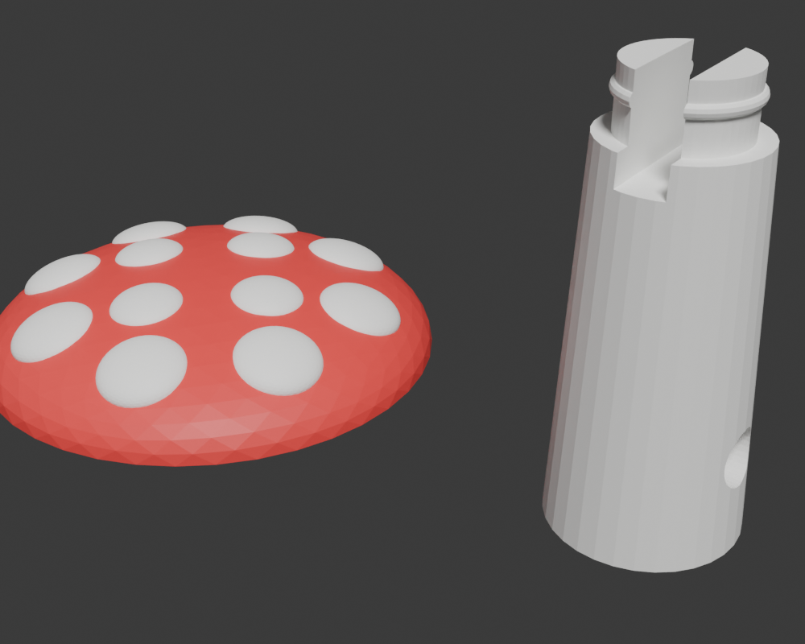
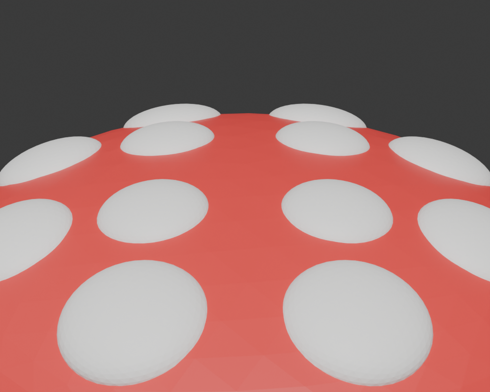
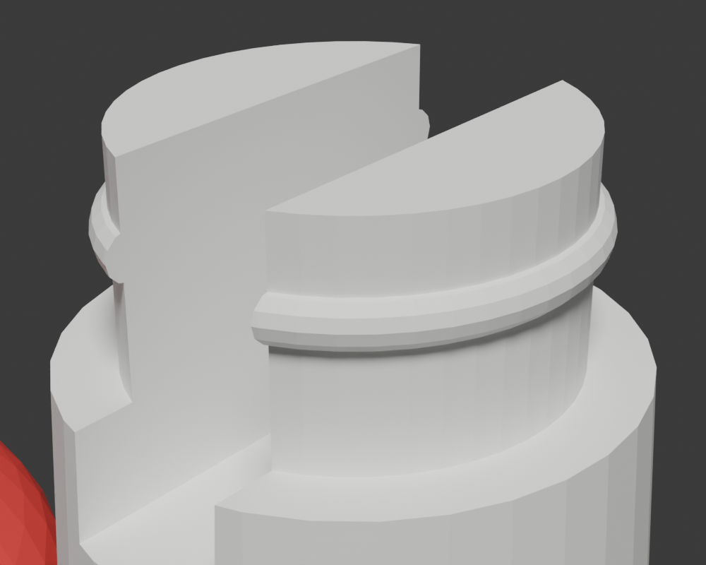
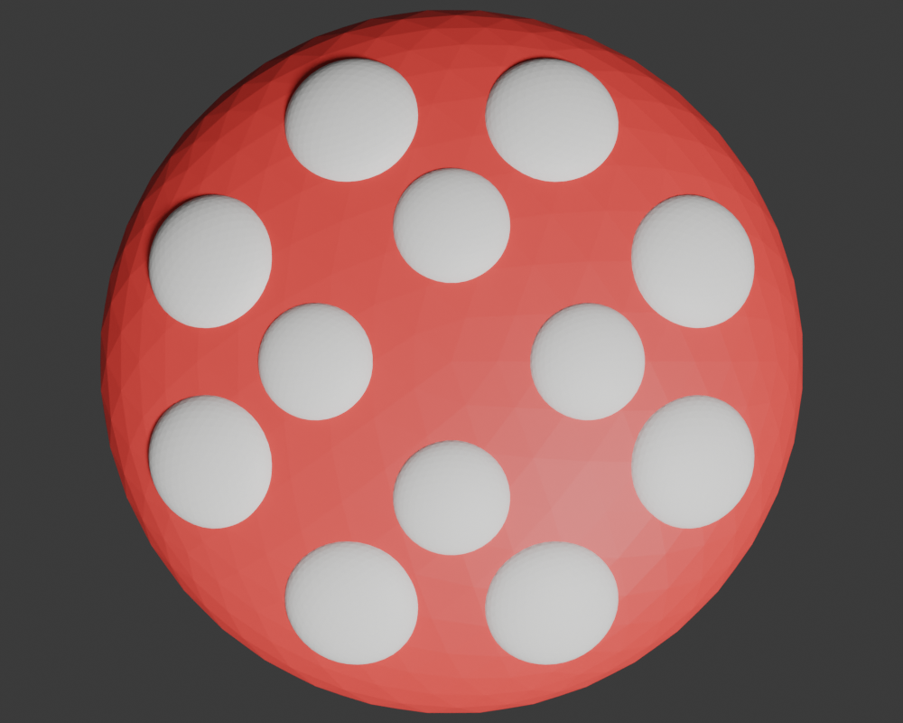

# Mushroom Keychain v3 — Click-Together, Zero Supports

A two-color amanita mushroom keychain, **redesigned twice from print reviews**. Gently domed
red cap with 12 rounded white spores, and a **separate white stem that clicks into the cap**
with a snap-fit post. Both parts print flat on the plate with **no supports, no bridges, and
the display face in perfect top-surface quality**. Keyring hole is ø3 mm.

**Model Used:** claude-fable-5 (Claude Code)


*Both parts exactly as they print: cap display-face-up, stem standing with the click post.*


*Rounded spore domes — the cut face is buried in the cap, only the curve shows.*

## Design History — Three Prints of Lessons

1. **v1 (printed):** upright one-piece mushroom. The domed cap forced tree supports (wasted
   filament) and the 13 full-sphere spots bulged out like fungus warts.
2. **v2 (drafts):** one-piece flipped upside-down to kill supports. First draft's flat-top
   cap read as a plate; second draft's flat-faced spore pads showed concave waists — and
   either way the 8 outer spores hovered over air in print orientation, printing as
   unsupported floating islands.
3. **v3 (this session):** split the parts. With the stem separate, the cap prints
   **display-face-up** — dome and spores fully supported from below, zero compromises —
   and the stem prints standing. A snap-fit click post joins them after printing.

## Design

| Element | Geometry |
|---|---|
| Cap | **True dome**: ellipsoid ø28 mm cut at its equator, so the widest circle *is* the flat base — the wall starts vertical at the plate and curves smoothly to the 5 mm apex. No under-curl rim, zero overhang printed face-up |
| Spores | Squashed spheres (z-scale 0.4) **cut below the equator, rounded side out**, cut face buried in the cap. 4 inner (r=2.2, ring r=5, tilted 8°) + 8 outer (r=2.6, ring r=9.8, interleaved 22.5°, tilted 19° to hug the dome). Inner ring deliberately smaller than outer |
| Snap socket (in cap) | ø6.4 bore, 3.4 deep, internal groove to r3.5 at 2.0 mm, ø7.4→6.4 entry chamfer (also defeats first-layer elephant-foot) |
| Click post (on stem) | ø6.2 shaft rising 3.3 mm above the stem shoulder, rounded snap ring to ø6.7 at 2.0 mm, 2.4 mm flex slot splitting it into two prongs |
| Stem | Tapered cone 5 → 4 mm over 20 mm; ø3 mm keyring hole near the base |


*The click post: slotted prongs, rounded snap ring, keyring bore below.*

**Snap engineering (FDM-tuned):** the ring squeezes 0.15 mm per side through the bore; the
slot lets each prong flex that far at ~3.5 % strain — inside PLA's limit for occasional
clicks (PETG clicks forever). The rounded torus profiles self-guide on insertion and allow
deliberate removal. Shaft-to-bore clearance is 0.1 mm per side; the post bottoms 0.1 mm
short of the socket ceiling so the cap always seats tight on the stem shoulder.

## How to Replay

Ensure the MCP server is running, then:

```bash
python -m src.main play community/mushroom_keychain/session.json
```

One replay wipes the scene, rebuilds everything, and exports **three** STL files:
- `mushroom_cap_red.stl` — the red cap with the snap socket (flat face on Z=0)
- `mushroom_spores_white.stl` — the 12 white spores (same origin as the cap)
- `mushroom_stem_white.stl` — the white stem with click post (its own object, standing)

**Checkpoint: Inspect Phases**
Use the session editor to stop at these phase markers:
- **End of Phase 1** (command 12): domed cap with click socket
- **End of Phase 2** (command 35): cap with all 12 rounded spores
- **End of Phase 3** (command 48): stem with click post and keyring bore

> [!IMPORTANT]
> Use the current bundled Blender addon (`blender_mcp_addon/`) — this session relies on
> batch-safe `delete *`, exact boolean solvers, modifier baking, hex `base_color`
> materials, `create_torus`, and `duplicate_object` placement.

## Hard-Won Lessons Baked Into This Session

- **Splitting parts beats clever orientation.** Two trivially printable parts + a snap
  joint outperform any single-piece orientation: v2's flipped one-piece design always left
  some spores printing as floating islands over air.
- **UNION overlapping shells — never `join_objects` them before a boolean.** Joining the
  stem + post + ring produced a self-intersecting mesh that the EXACT solver silently
  reduced to **zero triangles**. Boolean UNION each piece in, apply, then cut.
- **Never trust object origins mid-pipeline.** The deployed addon bakes location into the
  mesh during dimension-fitting, so origins quietly end up at world zero. Templates for
  `duplicate_object` must be built **at the world origin** (origin == mesh center survives
  any addon version), and final placement uses `location_offset` — pure translation,
  origin-independent.
- **One object per `transform_object` call.** The bridge schema types `object_name` as a
  string; a list is silently dropped with `success: false` in the payload — and playback
  still prints SUCCESS. **Verify geometry (STL triangle counts and bounding boxes), not
  exit codes.**
- **Spores: bury the cut, show the curve.** Flat-face-out pads read as machined buttons
  with concave waists; rounded-side-out reads as amanita.
- **STL carries no color.** Color comes from importing cap + spores as one multi-part
  object in the slicer and assigning a filament per part.

## Printing (Bambu Studio Two-Color Setup)

1. **Add two filaments**: slot **1 = red**, slot **2 = white**.
2. **File → Import**, select `mushroom_cap_red.stl` **and** `mushroom_spores_white.stl`
   **together in one dialog** → answer **Yes** to *"Load these files as a single object
   with multiple parts?"* — the spores snap onto the cap (same origin).
3. **File → Import** again, `mushroom_stem_white.stl` **by itself** — it loads as its own
   object standing next to the cap (if asked to merge, answer **No**).
4. In the **Objects tab**, expand the cap object and set per part:
   - `mushroom_cap_red` part → filament **1** (red)
   - `mushroom_spores_white` part → filament **2** (white)
   - the stem object → filament **2** (white)
5. **Supports: OFF.** Both parts are fully self-supporting: the cap is a dome rising from
   its flat base, the stem is a standing taper (the ø3 mm keyring bore and the small snap
   details bridge themselves).
6. Slice and print — one job, two colors, no support waste.

### Assembly

Push the stem's click post into the socket under the cap until it **clicks** — the prongs
flex inward, the ring seats in the groove, and the cap sits flush on the stem shoulder.
It's firm but reversible; add a dab of glue if you want it permanent. (PLA prongs tolerate
occasional re-clicking; PETG tolerates lots.)

### Print Notes

- The spore undersides are buried ~0.2 mm into the cap — intentional overlap; the slicer
  resolves interpenetrating parts (spore volume white, cap volume red).
- The flex slot shows as a small 1.6 mm notch on the stem sides just below the shoulder —
  hidden once the cap is clicked on.
- If the click is too tight or too loose, scale the **stem only** ±1–2 % in the slicer —
  it adjusts the interference without touching the cap.

### Spore Layout


*Top view — 4 smaller inner spores + 8 larger outer, interleaved.*

### Assets

`keychain_v3_*.png` are the current renders; `keychain_cap.png`, `keychain_stem.png`,
`keychain_render.png`, and `mushroom_printed.jpeg` are from **v1**, kept for design
history. `mushroom_keychain.3mf` is the v1 Bambu project — rebuild it from the new STLs.
