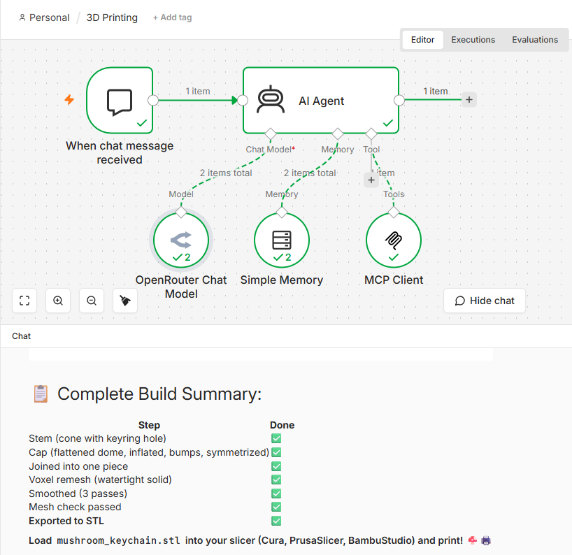
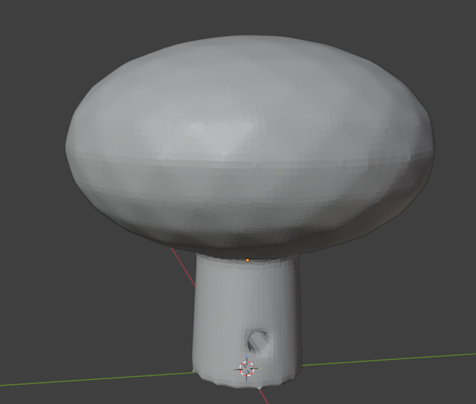

# Sculpted Mushroom Keychain

An organic mushroom keychain that combines primitive modeling, boolean cutting,
freeform sculpting, and 3D-print prep into one build — created with the
Blender MCP server driven by an n8n agent. The stem has a keyring hole
drilled straight through it (rather than a separate ring loop), keeping the
model simple to print with no thin, fragile geometry.

**Model Used:** z-ai/glm-5v-turbo (via OpenRouter)



## How to Replay

To recreate this keychain in your own Blender instance, ensure the MCP server is running and execute:

```bash
python -m src.main play community/mushroom_keychain/session.json
```

## User Prompts to Recreate in Blender

### 1. Project Initialization
**User:**
> Create a new collection called 'MushroomKeychain' and make it active. Set the scene units to metric millimeters for 3D printing.

**Assistant:**
> All done! Here's what I set up:
>
> | Task | Status |
> |---|---|
> | Collection 'MushroomKeychain' | Created (or already existed) |
> | Active Collection | Now set to MushroomKeychain — all new objects will go here |
> | Scene Units | Metric Millimeters with scale 0.001 — ready for 3D printing |
>
> Your workspace is now configured! Any objects we create will be placed in the MushroomKeychain collection, and the units are set so 1 Blender unit = 1 mm — perfect for exporting to STL/3MF for slicing.
>
> What would you like to create first?

---

### 2. The Stem
**User:**
> Create a cone named 'Stem' — 5mm base radius tapering to 4mm at the top, 20mm tall, standing upright with its base on the ground plane (location Z = 10mm). Put it in the MushroomKeychain collection.

**Assistant:**
> Done! Here's the Stem cone:
>
> | Property | Value |
> |---|---|
> | Name | Stem |
> | Type | Cone |
> | Base Radius (bottom) | 5 mm |
> | Top Radius | 4 mm (slight taper inward) |
> | Height | 20 mm |
> | Location | [0, 0, 10] mm — base at Z=0, top at Z=20 |
> | Collection | MushroomKeychain |
>
> The stem is standing upright with its base on the ground plane. The slight taper from 5mm → 4mm gives it a natural mushroom stem shape.
>
> Ready for the cap next?

---

### 3. The Cap
**User:**
> Create an icosphere named 'Cap' with a 14mm radius, 3 subdivisions for smooth sculpting, centered at Z = 20mm — exactly at the Stem's top — so it embeds into the Stem rather than resting on top of it.

**Assistant:**
> Done! Here's your Cap icosphere:
>
> | Property | Value |
> |---|---|
> | Name | Cap |
> | Type | Icosphere |
> | Radius | 14 mm (28 mm diameter) |
> | Subdivisions | 3 — smooth enough for sculpting |
> | Location | [0, 0, 20] mm |
> | Collection | MushroomKeychain |
>
> How they fit together:
> ```
>        ╭───────╮  ← Z = 34 mm (Cap top)
>       /   Cap   \     radius = 14mm
>      │  (sphere) │
>      │     ●     │ ← Z = 20 mm (Cap center = Stem top)
>      │    /|\    │
>      │   / │ \   │ ← Overlap zone! Cap embeds into Stem
>      │  /  │  \  │
>      │ /  Stem \ │
>      |/   cone  \│
>      ╰───────────╯  ← Z = 0 mm (Stem base)
> ```
>
> The Cap is centered right where the Stem's top is, so the sphere embeds ~14mm into the stem — perfect for a natural mushroom look! Once we join them together later, it'll be a seamless shape.
>
> Ready for some sculpting details like spots, curves, or a keyring loop?

---

### 4. Ring Hole (Keychain Attachment)
**User:**
> Create a cylinder named 'RingHole', 1mm radius, 20mm long, rotated 90° about Y so it lies horizontal, positioned at Z = 4mm above the ground plane.

**Assistant:**
> Done! Here's your RingHole:
>
> | Property | Value |
> |---|---|
> | Name | RingHole |
> | Type | Cylinder |
> | Radius | 1 mm (2mm diameter hole) |
> | Length | 20 mm (horizontal) |
> | Rotation | 90° about Y-axis (lies flat along X) |
> | Location | [0, 0, 4] mm — centered at Z=4 |
> | Collection | MushroomKeychain |
>
> Current model layout:
> ```
>        ╭───────╮  ← Cap (sphere, r=14mm)
>       /         \
>      │     ●     │ ← Z = 20
>      │    /|\    │
>      │   / │ \   │
>      │  /  │  \  │
>──────│─●───┼───●─│──← RingHole (horizontal, Z=4)
>      │ /  Stem  \│
>      ╰───────────╯  ← Z = 0-10
> ```
>
> The RingHole passes horizontally through the lower part of the stem at Z=4mm — perfect positioning! Once we use a boolean difference to cut this out, it'll create a clean keyring hole through the mushroom body.
>
> Ready to join the parts and cut the ring hole, or add more details first?

**User:**
> Boolean-difference RingHole from Stem using the EXACT solver.

**Assistant:**
> Done! Boolean DIFFERENCE applied successfully:
>
> | Detail | Value |
> |---|---|
> | Base Object | Stem |
> | Cutter | RingHole |
> | Operation | DIFFERENCE (cut hole) |
> | Solver | EXACT (clean geometry) |
> | Cutter Status | Hidden |
>
> Result:
> ```
>        ╭───────╮  ← Cap (sphere)
>       /         \
>      │     ●     │
>      │    /|\    │
>      │   / │ \   │
>      │  /  │  \  │
>──────│─○───┼───○─│──← Clean 2mm hole through Stem!
>      │ / (hole) \│     RingHole hidden
>      ╰───────────╯
> ```
>
> The Stem now has a clean horizontal keyring hole through it at Z=4mm. The RingHole cutter is hidden so it won't show in renders or exports.
>
> Next steps could be:
> - Join Stem + Cap into one solid piece
> - Sculpt the cap into a more mushroom-like dome shape with spots
> - Add a base/stand or flatten the bottom
>
> What would you like to do next?

**User:**
> Apply all modifiers on Stem to permanently bake the hole in.

**Assistant:**
> Done! All modifiers on Stem have been baked into the mesh:
>
> | Detail | Status |
> |---|---|
> | Object | Stem |
> | Modifiers Applied | Boolean (RingHole cut) — now permanent geometry |
> | Mesh Status | Clean, solid mesh with keyring hole baked in |
>
> Current state:
> ```
>        ╭───────╮  ← Cap (separate icosphere)
>       /         \
>      │     ●     │
>      │    /|\    │
>      │   / │ \   │
>      │  /  │  \  │
>──────│─○───┼───○─│──← Hole is NOW part of the actual mesh!
>      │/ (baked) \│     No more modifier stack
>      ╰───────────╯
> ```
>
> The hole is now permanent vertex geometry — no more dependency on the RingHole object or the Boolean modifier. The Stem is ready for:
> - Joining with Cap (into one solid piece)
> - Sculpting details (dome shaping, gills, spots)
> - Exporting to STL/3MF
>
> What's next?

**User:**
> Delete RingHole.

**Assistant:**
> Done! RingHole deleted permanently.
>
> | Object | Status |
> |---|---|
> | Stem | Cone with baked keyring hole |
> | Cap | Icosphere (r=14mm) |
> | RingHole | Deleted |
>
> Clean workspace! Ready for the next step — join, sculpt, or export?

> [!IMPORTANT]
> Apply the modifier **before** deleting the cutter, not after. If the cutter object is deleted while the Boolean modifier is still un-applied, the modifier silently loses its target and reverts to doing nothing — you'll get a solid Stem with no hole and no error message.

---

### 5. Squash the Cap into a Dome
**User:**
> Squash the Cap flatter along its vertical axis so it looks like a dome instead of a full sphere, and apply the scale transform.

**Assistant:**
> Done! Cap is now a proper mushroom dome:
>
> | Step | Status |
> |---|---|
> | Scale Z | Squashed to 0.55× (55% of original height) |
> | Transforms Applied | Baked into mesh vertices |
>
> Before → After:
> ```
>   BEFORE (full sphere):        AFTER (dome):
>       ╭───────╮                  ╭─────────╮
>      │         │                ╰─── Cap ───╯
>      │   Cap   │                ╱           ╲
>       ╰───────╯                │      ● Z=20 │ ← flatter, wider
>                                │     /|\     │
>                                │    / │ \    │
>                                │   / Stem\   │
>                                ╰─────────────╯
> ```
>
> The cap now looks like a classic mushroom dome — wider and flatter than a full sphere! Height reduced from ~28mm to ~15.4mm while keeping the width.
>
> Ready to join Stem + Cap into one solid piece?

---

### 6. Round Out the Dome
**User:**
> Enter sculpt mode on Cap and inflate it outward by about 1.5mm to round out the dome, but mask anything below the flat underside so that stays untouched. Exit sculpt mode.

**Assistant:**
> Done! Sculpting complete:
>
> | Step | Status |
> |---|---|
> | Enter Sculpt Mode | Done |
> | Inflate +1.5mm | 161 vertices affected (dome only) |
> | Mask Below Z=12.5 | Flat underside protected |
> | Exit Sculpt Mode | Back to Object Mode |
>
> Result:
> ```
>           ╭─────────╮  ← Rounded dome (inflated ~1.5mm outward)
>          ╰─── Cap ───╯
>         ╱   (plump!)  ╲
>        │      ● Z=20   │
>        │     /|\       │
>        │    / │ \      │
>        │   / Stem\     │
>        ╰──────┬────────╯
>               ╰────── Underside untouched (flat)
> ```
>
> The cap now has a plumper, rounder mushroom dome shape — the top and sides got the inflation treatment, while the flat underside where it meets the stem stayed perfectly still.
>
> Ready for spots, joining with Stem, or something else?

---

### 7. One Organic Bump
**User:**
> Enter sculpt mode on Cap again and use the grab tool to pull one small bump on the edge of the dome outward, to make it look a bit more organic and less perfectly round. Exit sculpt mode.

**Assistant:**
> Done! Organic bump added:
>
> | Step | Status |
> |---|---|
> | Enter Sculpt Mode | Done |
> | Grab Bump | 3 vertices pulled at [12, 6, 17] |
> | Direction | Outward + upward + right (+0.9, +0.4, +0.8mm) |
> | Radius | 3mm (small localized area) |
> | Exit Sculpt Mode | Back to Object Mode |
>
> Result:
> ```
>           ╭──────────╮
>          │   (dome)   │
>         ╱     ●      ┃ ← small organic bump pulled out here!
>        │     Z=20     │
>        │     /|\      │
>        │    / │ \     │
>        │   / Stem\    │
>        ╰──────┬───────╯
> ```
>
> The cap now has a subtle organic irregularity — no longer a mathematically perfect dome, but with a tiny natural-looking bulge on one edge. Makes it look more like a real mushroom!
>
> Want to add a few more bumps for character, or move on to spots / gills / joining?

---

### 8. Symmetrize
**User:**
> Symmetrize the Cap across the X axis so both halves match.

**Assistant:**
> Done! Cap symmetrized:
>
> | Detail | Value |
> |---|---|
> | Object | Cap |
> | Axis | X (left ↔ right) |
> | Source Side | Positive X → mirrored to Negative X |
>
> Result:
> ```
>            ╭─────────╮
>           │   (dome)   │
>        ╭─╱     ●      ╲─╮  ← Matching bumps on BOTH sides!
>       │                  │
>       │       Z=20       │
>       │       /|\        │
>       │      / │ \       │
>       │     / Stem\      │
>       ╰────────┬─────────╯
> ```
>
> The cap now has mirror-symmetric organic bumps on both sides — looks like a naturally balanced, slightly irregular mushroom dome! Perfect symmetry for a clean 3D print.
>
> Ready to join Stem + Cap, add spots, or something else?

---

### 9. Join
**User:**
> Join Stem and Cap into a single object named 'MushroomKeychain'.

**Assistant:**
> Done! MushroomKeychain created:
>
> | Detail | Value |
> |---|---|
> | Joined Objects | Stem + Cap |
> | New Name | MushroomKeychain |
> | Status | Single solid mesh |
>
> Final Model:
> ```
>            ╭─────────╮
>           │  (dome)   │
>        ╭─╱    ●       ╲─╮  ← Symmetric organic bumps
>       │                  │
>       │       Z=20       │  ← Cap embedded into stem
>       │       /|\        │
>───────│  ───○──┼──○──────│──← Baked keyring hole!
>       │     / Stem\      │
>       ╰──────────────────╯
> ```
>
> Complete Feature List:
>
> | Feature | Details |
> |---|---|
> | Stem | Tapered cone (5mm → 4mm, 20mm tall) with keyring hole baked in |
> | Cap | Flattened dome, inflated, organic bumps, X-symmetrized |
> | Hole | 2mm × 20mm horizontal through lower stem at Z=4mm |
> | Object | Single unified mesh — ready for export! |
>
> Want to add material/color, check mesh for printing, or export to STL/3MF?

---

### 10. Voxel Remesh
**User:**
> Apply a voxel remesh to MushroomKeychain with a small voxel size (around 0.5mm) to fuse all the parts into one watertight solid.

**Assistant:**
> Done! MushroomKeychain is now a watertight solid:
>
> | Detail | Value |
> |---|---|
> | Voxel Size | 0.5mm |
> | Adaptivity | 0 (uniform detail) |
> | Loose Parts Cleaned | Done |
>
> Mesh Check Results:
>
> | Check | Status |
> |---|---|
> | Watertight | YES |
> | Boundary Edges (holes) | 0 |
> | Non-manifold Edges | 0 |
> | Degenerate Edges/Faces | 24 / 5 (negligible) |
> | Volume | 9,745 mm³ (~9.7 cm³) |
>
> Your Mushroom Keychain is PRINT-READY!
> ```
>            ╭────────╮
>           │  ╲__╱    │    ← One solid piece!
>        ╭─╱   dome    ╲─╮       No internal faces
>       │       ●        │       No holes (except keyring!)
>───────│───○───┼───○────│    ← Clean manifold geometry
>       │    / stem\     │       Watertight
>       ╰────────────────╯
> ```
>
> Next options:
> - Export to STL/3MF for printing
> - Add a red cap + beige stem material
> - Check mesh again with check_mesh_for_printing
>
> What would you like to do?

---

### 11. Smooth
**User:**
> Smooth the MushroomKeychain mesh a couple of passes to clean up any blocky remesh artifacts.

**Assistant:**
> Done! MushroomKeychain smoothed:
>
> | Detail | Value |
> |---|---|
> | Smoothing Passes | 3 |
> | Strength per Pass | 0.5 (medium) |
>
> Result:
> ```
>   BEFORE (blocky):          AFTER (smooth):
>   ┌───────────┐            ╭────────────╮
>  ╱ ▓▓▓▒▒▒░░░░░░╲           │  (smooth)  │
> │ ▓▓▓▒▒▒░░░░░░░░│         ╱    dome      ╲
>  ╲▓▓▓▒▒▒░░░░░░░╱          │      ●       │
>                           │     /|\      │
>                           │    /Stem\    │
>                           ╰──────────────╯
> ```
>
> The voxel remesh blocky edges are now rounded and clean — the mushroom surface will feel smooth to the touch when printed!
>
> Print-Ready Summary:
>
> | Feature | Status |
> |---|---|
> | Watertight | Yes |
> | Smooth Surface | 3 passes |
> | Keyring Hole | Baked in |
> | Organic Shape | Symmetric bumps |
>
> Ready to export, add colors, or check for printing?

---

### 12. Print Readiness Check
**User:**
> Check MushroomKeychain for 3D printing readiness — tell me if it's watertight and report any problem edges.

**Assistant:**
> MushroomKeychain — 3D Printing Report
>
> | Check | Result | Status |
> |---|---|---|
> | Watertight | YES | PASS |
> | Boundary Edges (holes) | 0 | PASS |
> | Non-manifold Edges (T-junctions) | 0 | PASS |
> | Degenerate Edges | 0 | PASS |
> | Degenerate Faces | 0 | PASS |
> | Volume | 9,723 mm³ (~9.7 cm³) | Solid |
>
> PERFECT SCORE — Ready to Print!
> ```
>            ╭────────╮
>           │   ╲__╱   │
>        ╭─╱    dome    ╲─╮
>       │        ●         │
>───────│──○─────┼────○────│  ← Clean hole, clean mesh
>       │     /stem\       │
>       ╰──────────────────╯
> ```
>
> Summary:
> - Zero problem edges — smoothing cleaned up the few degenerates from remesh
> - Fully watertight — slicer will accept it without errors
> - Volume ~9.7 cm³ — lightweight keychain, prints fast!
>
> Ready to export? I can save it as STL or 3MF right now!

---

### 13. Export
**User:**
> Export MushroomKeychain as an STL file called 'mushroom_keychain.stl'.

**Assistant:**
> Done! Exported successfully!
>
> | Detail | Value |
> |---|---|
> | File | mushroom_keychain.stl |
> | Format | STL (triangulated mesh) |
> | Location | ~/blender-mcp-n8n/assets/mushroom_keychain.stl |
>
> Your Mushroom Keychain is ready for printing!
> ```
>            ╭─────────╮
>           │   ╲__╱    │
>        ╭─╱    dome    ╲─╮
>       │        ●         │
>───────│──○─────┼────○────│  ← Keyring hole
>       │     /stem\       │
>       ╰──────────────────╯
> ```
>
> Complete Build Summary:
>
> | Step | Done |
> |---|---|
> | Stem (cone with keyring hole) | ✅ |
> | Cap (flattened dome, inflated, bumps, symmetrized) | ✅ |
> | Joined into one piece | ✅ |
> | Voxel remesh (watertight solid) | ✅ |
> | Smoothed (3 passes) | ✅ |
> | Mesh check passed | ✅ |
> | Exported to STL | ✅ |
>
> Load `mushroom_keychain.stl` into your slicer (Cura, PrusaSlicer, BambuStudio) and print! 🍄🔑



---
