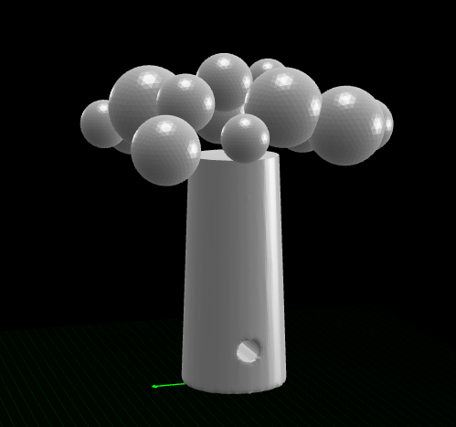
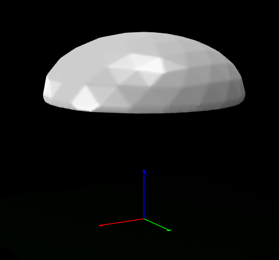
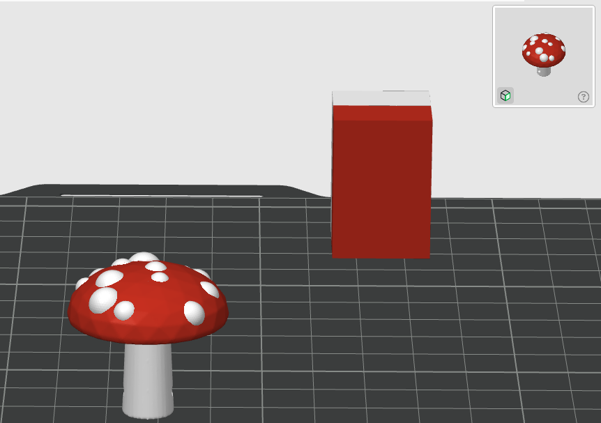
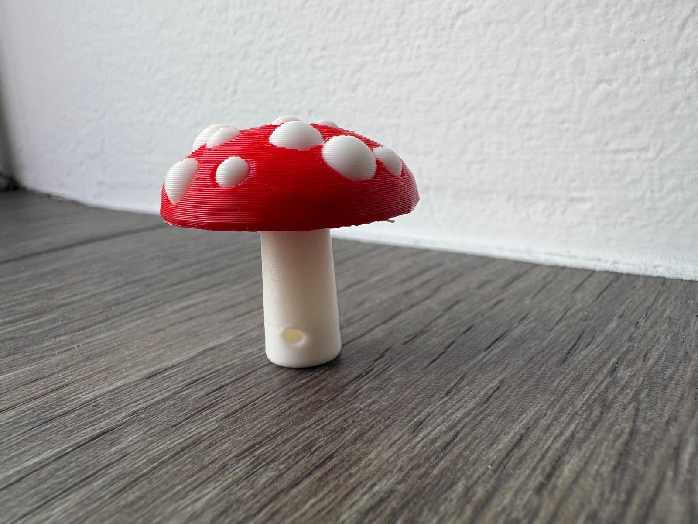

# Sculpted Mushroom Keychain — Red Cap, White Spots

A two-color sculpted mushroom keychain built in three phases: cap sculpting, undercut with
bell chamber, then 13 warts socketed onto the finished smooth surface. Red cap, white spots
and stem for the classic amanita two-color 3D print. The stem has a keyring hole drilled
straight through it, keeping geometry simple with no fragile parts.

**Model Used:** claude-fable-5 (Claude Code)




## How to Replay

To recreate this keychain in your own Blender instance, ensure the MCP server is running and execute:

```bash
python -m src.main play community/mushroom_keychain/session.json
```

One replay produces the complete two-color mushroom and exports two **same-origin** STL files:
- `mushroom_cap_red.stl` — the red cap
- `mushroom_stem_white.stl` — the white body (stem + 13 spots)

Both files share the same world coordinates, so they reassemble perfectly in the slicer.
The session is idempotent: it wipes the scene and rebuilds from scratch every run.

**Checkpoint: Inspect Phases**
Use the session editor to stop at these phase markers and view intermediate results:
- **End of Phase 1** (command 15): Sculpted dome with organic bumps, X-symmetrized — before the undercut
- **End of Phase 2** (command 23): Smooth cap with bell undercut and flat bottom — before warts are added

> [!IMPORTANT]
> Use the current bundled Blender addon (`blender_mcp_addon/`) — this session relies on
> its batch-safe `delete *`, exact boolean solvers, and modifier baking. Older addon builds
> may fail the cleanup or produce misaligned geometry on the undercut.

## What the Session Builds

| Stage | Highlights |
|---|---|
| Stem | Tapered cone (5 → 4 mm, 24 mm tall) with keyring hole (ø2 mm, re-drilled post-remesh for crispness) |
| Cap — Phase 1 | Flattened icosphere (14 mm r, 0.55 scale), squashed dome shape, sculpted with inflate + grab for organic bumps, X-symmetrized |
| Cap — Phase 2 | **Undercut** — flat slice at Z=19 removes the ellipsoid's curl-under lower wall (proven root cause of earlier shattering). Bell hollowed into flat face: ceiling Z=21.4 (50% green-line height), opening r~12.2, flat rim ring 3.2 mm (sized so every wart keeps ≥1 mm cap wall above bell). Then 0.25 mm voxel remesh + Laplacian smooth. **Nothing smooths after this** — warts cannot be erased. |
| Spores — Phase 3 | 13 white warts (r=2.0–3.6 mm, subdivision 4) positioned to socket into the red cap with verified ≥1.00 mm clearance above bell. Stem trimmed to bell ceiling, joined with warts into MushroomWhite body. |
| Materials | Red cap (RGB 0.8, 0.05, 0.05); white body (RGB 0.92, 0.92, 0.90) — colors baked for slicer visibility |
| Print prep | Bake all booleans → remesh + smooth cap → trim stem → join stem + warts → `check_mesh_for_printing` on both bodies → export two aligned STLs |

## Hard-Won Lessons Baked Into This Session

- **Boolean difference after smooth destroys geometry.** Cutting warts INTO the smooth cap via DIFFERENCE broke the undercut and bell. **Fix:** Keep warts as separate white objects, trim stem against cap edge, join stem + warts into one body for printing.
- **The undercut at Z=19 is load-bearing.** It kills the curl-under wall where the old ellipsoid tried to punch through in X/Y. Without it, any socket-cutter will rupture side walls.
- **Re-drill holes AFTER remesh + smooth.** The keyring hole closes or distorts during remesh; cutting it again post-smooth gives a crisp bore.
- **STL carries no color.** Cap and stem/warts are exported as two same-origin STLs; the Blender materials (red and white) only style the viewport. Color comes from importing both files as one multi-part object in the slicer and assigning a filament per part.

## Printing (Bambu Studio Two-Color Setup)

The key step: import **both STLs together as one multi-part object**. Filament assignment in
Bambu Studio happens per *part*, and parts only exist when the files are loaded as one object.

1. **Add two filaments first.** In the Prepare tab's **Filament** section, click **+** so the
   project has two filament slots: **1 = red**, **2 = white**. With only one slot defined,
   every part points at the same filament and "changing the color" recolors the whole model.
2. **File → Import**, and select **both** `mushroom_cap_red.stl` and `mushroom_stem_white.stl`
   **in the same import dialog**.
3. Bambu Studio asks: *"Load these files as a single object with multiple parts?"* → click **Yes**.
   The cap and body snap into their original assembled positions (they share the same origin).
4. Assign colors in the **Objects tab**, not the 3D viewport — clicking the model in the
   viewport always selects the whole object; parts are only reachable in the list. In the left
   sidebar switch **Global → Objects**, click the **expand arrow (▸)** on the object, and set
   the filament dropdown on each **part row**:
   - `mushroom_cap_red` part → filament **1** (red)
   - `mushroom_stem_white` part → filament **2** (white)

   If the object shows **no expand arrow**, the meshes fused into one part on import —
   right-click the object → **Split → To parts**, then assign red to the cap row and white
   to the stem + spot rows (splitting is by loose shells, so the spots become their own rows).
5. Enable supports: **Support → Tree (auto)**. Upright, the flat rim ring under the cap is a
   near-horizontal overhang and needs them — but the trees only touch the under-cap region,
   so the scars are hidden on the finished piece.
6. Slice and print. The model prints upright — flat stem base on the plate.

> [!WARNING]
> If you import the files one at a time (or answer **No**), they load as two independent
> objects: Bambu Studio scatters them across the plate and per-part coloring won't work.
> Delete them and re-import both together.

### Print Notes

- The white spots sit half-buried in the cap — the overlap is intentional. Slicers resolve
  interpenetrating parts cleanly: the wart volume prints white, the cap volume red.
- **Don't tilt the model hoping to skip supports.** Tilted 45°, the mushroom rests on a
  knife-edge of cap rim and needs supports just to stand — relocated onto the visible cap
  surface. Upright with tree supports puts all contact marks under the cap where they're
  invisible. (To compare orientations yourself, rotate in the slicer — the multi-part object
  rotates as one — and check the sliced support volume.)
- Print time — ~30-45 min depending on layer height and infill (keychain scale).

Result: classic red amanita cap with crisp white warts, white stem meeting the bell interior,
keyring hole threaded through the stem.

**Note:** Bambu Studio may show a configuration warning about "ensure_vertical_shell_thickness"
being replaced with "enabled". This is normal and does not affect the print quality — simply
click OK to dismiss it.

### STL Render


*The complete exported model showing the assembled red cap with white warts and stem.*

### Printed Result


*The final two-color 3D printed mushroom keychain — red cap, white spores and stem.*

---
