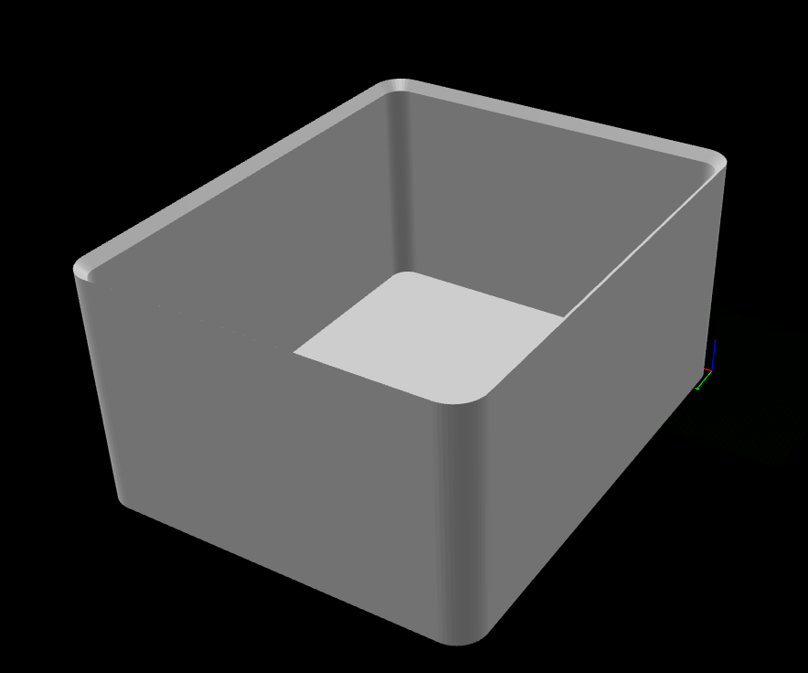

# Rounded Stackable Storage Bin

A fully parametric, 3D-printable storage bin that **nests into the one below it**.
Rounded-rectangle body, 45° top rim funnel, and a 45° self-supporting foot taper.
The wall is deliberately **flat** — exterior texture is applied in the slicer with
fuzzy skin, not modelled as geometry.



## Play it

```bash
# default 80 x 100 x 50 mm
python -m blender_mcp_bridge.main play community/stackable_bin/session.json

# any size you like — every dimension is parametric
python -m blender_mcp_bridge.main play community/stackable_bin/session.json \
  --param bin_width=50 --param bin_depth=80 --param bin_height=30
```

Exports `assets/stackable_bin.stl`, alongside this README.

## Worked example — 100 × 200 × 100 mm

A deep tote with the lower two bands vented, a divider at the halfway point,
a vented separator and a flat lid.

**bash / zsh**

```bash
S=community/stackable_bin/session.json
P="--param bin_width=100 --param bin_depth=200 --param bin_height=100
   --param bin_holes_1=1 --param bin_holes_2=1
   --param bin_divider_frac=0.5 --param bin_sep_holes=1"

python -m blender_mcp_bridge.main play $S $P                      # the bin
python -m blender_mcp_bridge.main play $S --branch separator $P   # the divider plate
python -m blender_mcp_bridge.main play $S --branch lid $P         # the lid
```

Render the images from Studio's Views tab (**⚡ All 4**) — see [Views](#views).

**PowerShell**

```powershell
$S = "community/stackable_bin/session.json"
$P = @(
  "--param","bin_width=100", "--param","bin_depth=200", "--param","bin_height=120",
  "--param","bin_holes_1=1", "--param","bin_holes_2=1",
  "--param","bin_divider_frac=0", "--param","bin_sep_holes=1"
)

python -m blender_mcp_bridge.main play $S @P                      # the bin
python -m blender_mcp_bridge.main play $S --branch separator @P   # the divider plate
python -m blender_mcp_bridge.main play $S --branch lid @P         # the lid
```

> [!NOTE]
> PowerShell needs an **array** plus the splat operator `@P` — not a plain
> string, and not `$env:P`. PowerShell passes a string to the process as ONE
> argument instead of word-splitting it the way bash does, so
> `python -m blender_mcp_bridge.main play $S $P` arrives as
> `argv[1:] == ['--param bin_width=100 --param bin_depth=200 ...']` and Click
> rejects it.

### What comes out

| part | size (mm) | triangles | volume |
|---|---|---|---|
| bin | 100.00 x 200.00 x 100.00 | 5,298 | 166.8 cm3 |
| separator | 95.20 x 89.00 x 1.60 | 1,632 | 8.9 cm3 |
| lid | 99.70 x 199.70 x 7.00 | 924 | 61.0 cm3 |

All three watertight, zero degenerate faces, zero non-manifold edges.

### Every fit, measured from the exported STLs

| fit | numbers | result |
|---|---|---|
| bin stacks on bin | funnel 94.00 < foot 97.00 < rim 100.00 | wedges, self-centring |
| separator held by rails | plate end 0.40 mm behind the rail face | firm |
| separator slides in slot | 1.60 mm plate in a 2.40 mm slot -> 0.40 mm/face | free |
| lid skirt in cavity | 95.76 in a 96.00 opening -> 0.12 mm/side | grips |
| separator vs lid skirt | rail top 92.50, skirt bottom 96.00 | +3.50 mm clear |

> [!NOTE]
> `bin_height=100` gives 16 mm bands — comfortably more than one 6 mm hole, so
> the vents tile two rows deep. Below about 40 mm the bands get shorter than a
> single hole and `bin_holes_*` cut nothing; drop `bin_hole_size` to 3 there.


> [!NOTE]
> Misspelt `--param` names are **rejected before the run starts**, with a
> did-you-mean suggestion. This used to pass silently and produce a plain bin at
> 100% reported success, which cost three wasted builds.

## Parameters

| Parameter | Default | Notes |
|---|---|---|
| `bin_width` | 80 | outer X, mm |
| `bin_depth` | 100 | outer Y, mm |
| `bin_height` | 50 | outer Z, mm |
| `bin_wall` | 2 | wall thickness |
| `bin_radius` | 6 | vertical corner fillet radius |
| `bin_rim_chamfer` | 3 | female funnel depth |
| `bin_foot_chamfer` | 1.5 | male foot taper — **must be < `bin_rim_chamfer`** |
| `bin_rib_height` | 4 | vent-band height, mm — **fixed, does not scale** |
| `bin_holes_1` | 0 | cut vent holes in band 1 (2nd band up) |
| `bin_holes_2` | 0 | cut vent holes in band 2 |
| `bin_holes_3` | 0 | cut vent holes in band 3 (top band) |
| `bin_hole_size` | 6 | square hole edge, mm — **fixed, does not scale** |
| `bin_hole_gap` | 3 | gap between holes, horizontal and vertical, mm |
| `bin_hole_margin` | 8 | minimum clear margin from each corner, mm |
| `bin_divider_frac` | 0 | **0 = no divider**; otherwise the divider position as a fraction of interior depth (0.5 = halfway). Clamped to 0.12–0.88 |
| `bin_rail_proud` | 4 | how deep each rail bites into the cavity — **this is the grip** |
| `bin_rail_width` | 1.2 | rail footprint along the wall (not the grip) |
| `bin_rail_ramp` | 3 | how far the rail's outward side ramps back to the wall, mm (0 = square step) |
| `bin_sep_thickness` | 1.6 | separator plate thickness |
| `bin_sep_clearance` | 0.8 | total slide clearance (0.4 mm per face) |
| `bin_sep_holes` | 0 | 1 = vent the separator, 0 = solid plate |
| `bin_sep_lid_gap` | 0.5 | how far the separator's top sits below the lid |
| `bin_sep_margin` | 4 | minimum border at the separator's top and bottom edges |
| `bin_lid_clearance` | 0.3 | total shrink of the lid vs the funnel it drops into |
| `bin_lid_knob` | 0 | **0 = flat lid**; otherwise the knob diameter in mm |
| `bin_lid_knob_height` | 6 | knob height, mm |
| `bin_lid_skirt` | 4 | retaining skirt drop, mm (0 = none) |
| `bin_lid_skirt_wall` | 1.6 | skirt thickness, mm |
| `bin_lid_skirt_clearance` | 0.25 | diametral clearance — this *is* the grip |

The three vent bands sit at 25%, 50% and 75% of `bin_height` and are a **fixed
`bin_rib_height` tall**. The solid panels are whatever is left between them, so a
taller bin gets taller panels — and therefore *more rows of holes*, not bigger
holes.

## Vent holes

Three band positions divide the wall into **four** panels. Bands 1–3 each have an
on/off flag; holes are cut through all four walls in whichever bands are enabled.

```
            ╔═══════════════╗
            ║  band 3       ║  bin_holes_3
            ╠═══════════════╣  ← band 3 line (75% of H)
            ║  band 2       ║  bin_holes_2
            ╠═══════════════╣  ← band 2 line (50% of H)
            ║  band 1       ║  bin_holes_1
            ╠═══════════════╣  ← band 1 line (25% of H)
            ║  band 0       ║  ALWAYS SOLID — no flag
            ╚═══════════════╝
```

> [!NOTE]
> **Band 0 has no flag and is always solid.** It carries the compressive load of
> a full stack and is the first region off the build plate, so holes there would
> cost strength and bed adhesion for no useful airflow.

```bash
# vent the top two bands
python -m blender_mcp_bridge.main play community/stackable_bin/session.json \
  --param bin_holes_2=1 --param bin_holes_3=1

# vent all three
python -m blender_mcp_bridge.main play community/stackable_bin/session.json \
  --param bin_holes_1=1 --param bin_holes_2=1 --param bin_holes_3=1
```

Holes are square, centred on each side with an **equal margin at both ends**, so
the pattern stays symmetric at any bin size:

```
n    = floor((span - 2*margin + gap) / (hole + gap))
lead = (span - (n*hole + (n-1)*gap)) / 2
```

Rows tile the same way vertically inside each band, so hole *count* scales with
the bin while hole *size* stays put — a 50mm bin gets one row per band, a 200mm
bin gets five.

> [!NOTE]
> Both `bin_hole_size` and `bin_rib_height` are **fixed millimetre values**, not
> fractions of the height. 
>
> The trade-off: at very small bins the panels can be shorter than one hole, and
> no holes are cut. At `bin_height=30` the bands are ~3.5mm, so drop
> `bin_hole_size` to 3 if you want vents at that size.

### How the flags work

The session format has no conditional, but it doesn't need one: a `for_each`
with `end=${flag}` runs **once** when the flag is `1` and **zero times** when it
is `0`.

```json
{"tool": "for_each",
 "arguments": {"var": "zone_1", "start": "1", "end": "${bin_holes_2}", "step": "1"},
 "body": [ ...hole cutters... ]}
```

With all flags off the hole cutters expand to nothing at all. The same idiom
drives every optional feature in this session — the divider, the separator
vents and the lid knob.

## Divider and separator

`bin_divider_frac` adds a pair of rails to each side wall; the separator plate
(built by the `separator` branch) slides down between them. The one parameter is
both the switch and the position — `0` means no divider, any other value places
it at that fraction of the interior depth.

```
top view                      front view
 ┌──────────────┐              ┌────────────┐
 │              │              │            │
 │═            ═│ ← rails      │═          ═│  rails run floor → below the rim
 │              │              │═          ═│
 └──────────────┘              └────────────┘
```

```bash
# rails at the halfway point (0.3 = 30% back), then the matching plate.
# Use the SAME parameters for both.
python -m blender_mcp_bridge.main play community/stackable_bin/session.json --param bin_divider_frac=0.5
python -m blender_mcp_bridge.main play community/stackable_bin/session.json --branch separator --param bin_divider_frac=0.5
```

Exports `assets/stackable_bin_separator.stl`. The plate is sized to the cavity minus
`bin_sep_clearance`, giving 0.40mm per face of slide clearance.

> [!NOTE]
> The plate is exported **lying flat on the build plate** (thickness on Z), not
> standing in its in-use orientation. Upright it would be a tall 1.6mm thin wall
> — slow, fragile and needing a brim — for a part that is simply flat. Rotate it
> into the bin yourself; the model does not.

The plate is **solid by default**; add `--param bin_sep_holes=1` to vent it with
the same hole tiling as the bin. It is much shorter than it is wide, so its
top/bottom border uses its own `bin_sep_margin` (4mm) rather than
`bin_hole_margin` (8mm), which would cost a whole row.

> [!IMPORTANT]
> The separator stops **below** where the rim funnel starts — full height, it
> would poke into the funnel and block both the lid and any bin stacked on top.
> Separator and lid both derive from `z = bin_height - bin_rim_chamfer`, so they
> would meet at exactly 0.00mm; `bin_sep_lid_gap` (0.5mm) drops the plate clear
> at any height. The rails still engage the full height of the plate.

There is deliberately **no bottom stop**: the bin floor already stops the plate,
and a ledge would trap debris and print as an unnecessary horizontal overhang.

### Why the rails are tapered

Each rail is a **tapered prism**, not a cube — the outward side ramps down to
the wall over `bin_rail_ramp` (3mm) instead of stepping.

A cube rail welds to the wall as one solid, so the wall's cross-section steps
2mm → 6mm → 2mm → 6mm → 2mm across ~4mm of Y. The slicer changes its perimeter
decision at each of those four steps, starting and stopping extrusions at the
same Y on every layer — and stacked over the full height that prints as a
**visible vertical seam down the outside of the wall**, right at the divider.
It is not a mesh defect; the geometry is watertight either way. It is the
thickness discontinuity the slicer reacts to.

Tapered, the thickness ramps 2.00 → 2.10 → 3.60 → 6.00 instead of stepping,
and the perimeter count changes gradually.

The ramp faces **away from the slot**, so both slot-facing walls stay square
and the plate is still gripped on a flat face over the full `bin_rail_proud`
bite — the slot measures a constant 2.40mm at every depth from the wall out to
the tip.

> [!IMPORTANT]
> All four rail outlines must be wound **the same way**. The L/R and A/B pairs
> are each mirrored, so emitting one vertex order for all four yields two CCW
> and two CW outlines; the CW ones come out with inverted normals and the union
> leaves the mesh non-manifold — 24 bad edges on exactly the two mirrored rails,
> with the ramp foot clipped from 105.4 to 105.067. The generator reverses the
> order for the mirrored cases.

### Rails vs vent holes

Holes sit every `hole + gap` (9mm by default) and a rail pair spans 4.0mm, while
the gaps between holes are only 3.0mm — so **no divider position can dodge the
holes**. Rather than let a rail bridge an opening, the generator **suppresses the
one hole each rail pair would cross**, on the left/right walls only; front/back
walls keep every hole. The rule is evaluated per hole inside the loop, using the
same `end=<expr>` gating idiom:

```
keep = ceil(min(1, max(0, |yc - div_y| - (rail_half + hole/2))))
```

`abs()` isn't in the expression evaluator, so `|d|` is written `max(d, -d)`.

> [!TIP]
> `bin_divider_frac` is **both the switch and the position**. An earlier version
> had a separate `bin_divider` enable flag, so
> `--param bin_divider=0.3` silently produced no rails at all: the flag gate ran
> `1..0.3`, i.e. zero iterations, while the position parameter went untouched.
> One parameter removes that trap.

## Lid

The `lid` branch caps a stack. It drops into the bin's rim funnel and finishes
**flush with the rim**, so a closed bin can still be stacked on.

```bash
# flat lid — stays stackable
python -m blender_mcp_bridge.main play community/stackable_bin/session.json --branch lid

# with a 20mm grip knob (blocks stacking on top)
python -m blender_mcp_bridge.main play community/stackable_bin/session.json --branch lid   --param bin_lid_knob=20
```

Exports `assets/stackable_bin_lid.stl`.

The lid needs no new mating geometry. The rim funnel is a 45° cone running from
`W - 2*rim_chamfer` up to `W` over `rim_chamfer` of height, so the lid is simply
its negative: a frustum of exactly `rim_chamfer` thickness with 45° sides.

```
        ┌────────────────┐   z = 3.00   79.70 mm   (flush with the 80.00 rim)
         \              /
          \____________/     z = 0.00   73.70 mm   (matches the funnel's narrow end)
```

Both faces are shrunk by the same `bin_lid_clearance`, which keeps the sides
parallel to the funnel so contact stays along the full 45° face rather than
pinching on one edge.

`bin_lid_knob` is both the switch and the diameter — `0` leaves the lid flat.

### The retaining skirt

A plain frustum in a matching funnel is held by **gravity alone** — there is no
undercut anywhere in that mate, so the first printed lid fell straight out when
the bin was tipped. `bin_lid_skirt` adds a thin wall hanging down from the lid's
underside into the cavity:

```
   ________________
   \              /     45° cone, seats in the funnel
    |            |       <- skirt, grips the cavity wall
```

Sized to the inner wall minus `bin_lid_skirt_clearance` (0.25mm diametral =
0.125mm a side), it is a light friction fit: enough to hold the lid through a
tip, still removable by hand. Raise the clearance if it is too tight to pull
off, lower it if the lid still drops.

> [!IMPORTANT]
> The skirt hangs **into the cavity**, so the separator has to clear it. Its
> height subtracts `bin_lid_skirt` as well as `bin_sep_lid_gap` — without that
> the two parts overlapped by 3.40mm.

## How the stacking works

```
        ____________________
       /                    \   <- rim funnel, 45 deg  (FEMALE receiver)
      |   ______________     |
      |  |              |    |
      |  |              |    |
      |  |              |    |
      |  |              |    |   <- flat wall (fuzzy skin adds the texture)
      |  |              |    |
      |  |              |    |
      |  |______________|    |
       \____________________/
        \                  /    <- foot taper, 45 deg  (MALE, self-supporting)
         \________________/
```

The foot of the upper bin drops into the funnel of the lower one and **wedges on
the 45° walls**, self-centring in X and Y.

For that to work the foot must land *between* the funnel's narrow and wide
diameters:

```
(W - 2*rim_chamfer)  <  (W - 2*foot_chamfer)  <  W
        74.20        <        77.00           <  80.00   ✓
```

> [!IMPORTANT]
> `bin_foot_chamfer` **must** be smaller than `bin_rim_chamfer`. Set them equal
> (both 3mm) and the foot comes out 74.10 — *smaller* than the funnel's
> narrowest point — so the bin drops straight through and rests flat on the rim.
> No wedge, no centring.

Every face is either vertical or a 45° overhang, so it prints **without supports**.

## Studio controls

The session carries an optional `parameter_ui` block that tells Studio to render
sliders and checkboxes instead of text boxes:

```json
"parameter_ui": {
  "bin_width":   { "type": "slider",   "min": 40, "max": 250, "step": 5, "unit": "mm" },
  "bin_holes_1": { "type": "checkbox", "on": "1", "off": "0", "label": "Vent band 1" }
}
```

Supported types are `slider`, `checkbox` and `select`. A parameter with no entry
falls back to the plain text input, so the block is entirely optional and no
existing session is affected.

Two things this block deliberately does **not** do:

- **It never changes playback.** Values are still stored as strings in
  `parameters` and resolved exactly as before; `parameter_ui` is presentation
  only. A slider that would produce a non-numeric value falls back to a text
  input rather than corrupting an expression.
- **It survives a round-trip.** `BridgeSession` carries the block through
  load → save, so editing a session in Studio does not silently strip it.

## Views

Top / front / side / iso images of the bin render into `BLENDER_ASSETS_DIR/views/`
(the copies kept with this project live in `assets/images/`), for the gallery and
for checking a parameter change without opening Blender.

Open **Studio's Views tab** (next to Commands, in the main pane), build the
model, then hit **⚡ All 4** — or a single `Top` / `Front` / `Side` / `Iso`
button. The buttons are labelled after Blender's own numpad mapping (7 / 1 / 3
/ 0).

> [!IMPORTANT]
> Rendering captures **whatever is already in the scene** — it does not rebuild
> the model. Play a model branch first, with the same parameters. (Render right
> after the `separator` branch and you get four pictures of a flat plate.)

This used to be a 29-command `views` branch: four lights, then a camera
created / aimed / activated / rendered / deleted per view, each with its
framing hand-derived as `${bin_width}`-style trigonometry. That is now the
`generate_views` tool, which reads the scene's own bounding box, so nothing has
to be re-derived per project — the branch is gone and the images are unchanged.
It is a normal tool, so it also works from the CLI or a session command:

```bash
# build the bin first, then render it
python -m blender_mcp_bridge.main play community/stackable_bin/session.json --param bin_holes_2=1
```

Cameras are **ORTHO** and framed per view — top spans W x D, front W x H, side
D x H — since a single global fit left the flat views filling only ~26% of the
frame height. ISO uses the bounding-box diagonal, because corner-on the
silhouette is wider than any single axis. The temporary camera and lights are
named `_MCPVIEW_*` and removed in a `finally` block, so an error mid-render
cannot leave strays in the scene.

Generation is disabled until a session is loaded: images land in one shared
folder keyed by a prefix taken from the session name, so without one every
project would overwrite the last. Click a thumbnail to enlarge; the filenames
stay the same across re-renders, so images are cache-busted on each refresh.

Studio's **3D tab** loads the exported STLs directly (three.js + STLLoader) —
orbit, zoom, wireframe, with the bounding box and triangle count read off the
mesh. The dropdown lists whatever the loaded session's `export_model` commands
produce, so it follows the session rather than the assets folder.

## Printing notes

Print **open side up**, no supports. Every face is vertical or a 45° overhang.

Tested on a Bambu Lab P2S with the stock **0.16mm High Quality** profile.

With the flat wall, the body has **zero unsupported overhang** — measured off the
exported STL, every downward-facing face above the build plate is either a 45°
taper or does not exist. The only settings worth changing from stock are:

| Tab | Setting | Stock | Use |
|---|---|---|---|
| Quality → Precision | Elephant foot compensation | 0.15 | **0** |
| Others → Fuzzy Skin | Fuzzy Skin | None | **Outside walls** |
| Others → Fuzzy Skin | Point distance | 0.8 | **0.6** mm |
| Others → Fuzzy Skin | Skin thickness | 0.3 | **0.3** mm |

The overhang and bridge speed reductions that earlier revisions of this part
needed are **no longer required** — they existed solely to cope with the proud
exterior ribs, which are gone. Stock speeds are fine throughout.

> [!NOTE]
> If you enable vent holes, the holes are square, so each one has a flat 6mm
> ceiling that prints as a short bridge. That is the one remaining overhang on
> the part and it is opt-in. Stock bridge settings handle a 6mm span; if you want
> them crisper, drop **Speed → Other layers → Bridge** to 20 mm/s.

### Elephant foot compensation → 0

Elephant foot compensation shrinks the first layer to cancel the outward splay
of a squished flat bottom. This part has no flat bottom — the first layer is the
**tip of the 45° foot cone**, which has very little material to splay in the
first place. Applying the correction just blunts the lead-in that engages the
funnel of the bin below.

It does not affect whether the bins mate: the wedge happens ~1mm up the cone,
above any squish zone. Set it to `0` for a crisp foot, and only raise it if you
actually see a lip on the printed part.

### Fuzzy skin — exterior texture with no geometry

Earlier revisions modelled proud exterior ribs for visual interest. They were
**removed entirely**, because a rib that stands out from the wall must by
construction leave an unsupported step on its underside: 0.9mm of relief laid
down in a single layer is a ~214% overhang at 0.42mm line width, and it drooled
filament on every print. Five attempts to chamfer the underside into a
self-supporting ramp all failed — `inset_faces` can only make a face *smaller*,
never larger, so no cutter can be given an outward-flaring top.

Fuzzy skin gets the same effect for free. It is a **slicer-side perturbation of
the outer wall path**, so it costs zero geometry, zero mesh risk, and no overhang
at all — the wall stays vertical, it just wobbles by a fraction of a bead.

In Bambu Studio / OrcaSlicer, under **Others → Fuzzy Skin**:

| Setting | Value | Why |
|---|---|---|
| Fuzzy Skin | `Contour and hole` | fuzzy skin effect is applied to both the outer contours and the holes of the model |
| Point distance | `0.6` mm | how often the wall is displaced — smaller is a finer grain |
| Skin thickness | `0.3` mm | how far it is displaced — keep **below** the 0.42mm line width |

> [!IMPORTANT]
> Use `Contour and hole`, **not** `All walls`. This part mates on 0.15–0.25mm
> clearances — the foot into the funnel, the lid skirt into the cavity, the
> separator into its rails. Fuzzing an interior surface would eat that clearance
> and jam the fit. `Outside walls` leaves every mating surface untouched.

Keeping *Skin thickness* under one line width also matters: displace further than
a bead and the wall stops being a continuous extrusion, which costs real strength
on a part that carries a stack.

> [!TIP]
> **Fuzzy Skin Painting** (the brush tool in the right-hand toolbar) applies the
> texture to regions you paint rather than the whole part. Useful here if you want
> a textured band at 25/50/75% of the height — the look the ribs were reaching
> for — with the rest of the wall left smooth.

Gridfinity, the most-printed bin system there is, uses chamfers and slicer
texture for exactly this reason: no printed bin system relies on proud ribs.

### The Z-seam on the rounded corners

Rounded vertical corners give the slicer nowhere to hide the layer start/stop
point, so it can stack into a visible line down one corner. The mesh is not the
cause (chord sag is 0.0006mm). Use `Seam position: Aligned` with **Smart scarf
seam**, which ramps the seam instead of depositing a blob at a point; `Random`
scatters the artifact rather than removing it.

## Construction notes

Regenerate with `python scratch/generate_stackable_bin.py`.

Three things in this build are deliberate and cost a rebuild each to discover —
the generator's docstring has the full detail:

1. **Both tapers use `inset_faces`, not rotated cutters.** Four straight 45°
   cutters cannot close a rim cleanly: shortened, they leave a full-height stub
   at every corner (a rotated cube removes a *band*, but the leftover region is
   a *square* — a band cannot match a square); full length, their flat unrotated
   end faces gouge V-troughs 15mm deep through the perpendicular walls. `inset`
   follows the face's own topology, so corners mitre themselves — and it works
   unchanged on a rounded outline, which cutters never could.

2. **Never union a band onto the wall.** The ribs are gone, but the reason they
   had to be *cut* rather than *added* still governs any future wall feature:
   band and body are rounded rects with identical corner arcs, so their vertical
   faces end up coplanar all the way round and the solver corrupts the mesh (a
   single union produced 56 degenerate triangles). Cut a recess instead — or,
   better, do it in the slicer, as the fuzzy skin section above argues.

3. **Every dimension is emitted as an expression string**, never a baked number,
   which is what makes `--param` work. Note that a bare `${bin_width}` resolves
   to the parameter's raw *string*; anything containing an operator is evaluated
   to a float — hence the `+ 0` idiom throughout.
